# Documentação do Schema Relacional — PersonaDB

Catálogo gerado automaticamente a partir dos arquivos DDL em `persona_db/sql/schema/` (**27 domínios**, **258 tabelas**).

## Índice por Domínio

- **00_hub** (1 tabelas): [`pessoa`](#pessoa)
- **01_identidade** (9 tabelas): [`pessoa_nome_anterior`](#pessoa_nome_anterior), [`pessoa_apelido`](#pessoa_apelido), [`pessoa_documento`](#pessoa_documento), [`pessoa_biometria`](#pessoa_biometria), [`pessoa_foto`](#pessoa_foto), [`pessoa_assinatura`](#pessoa_assinatura), [`pessoa_caracteristica_fisica`](#pessoa_caracteristica_fisica), [`pessoa_marca_distintiva`](#pessoa_marca_distintiva), [`pessoa_idioma`](#pessoa_idioma)
- **02_genealogia** (10 tabelas): [`familia`](#familia), [`membro_familia`](#membro_familia), [`parentesco`](#parentesco), [`arvore_genealogica`](#arvore_genealogica), [`heranca`](#heranca), [`heranca_item`](#heranca_item), [`doacao_familiar`](#doacao_familiar), [`condicao_genetica`](#condicao_genetica), [`predisposicao_genetica`](#predisposicao_genetica), [`ancestralidade_ficticia`](#ancestralidade_ficticia)
- **03_saude** (27 tabelas): [`doenca`](#doenca), [`sintoma`](#sintoma), [`medicamento`](#medicamento), [`cirurgiao`](#cirurgiao), [`hospital`](#hospital), [`leito`](#leito), [`vacina`](#vacina), [`plano_saude`](#plano_saude), [`convenio`](#convenio), [`doenca_pessoa`](#doenca_pessoa), [`tratamento`](#tratamento), [`sintoma_ocorrencia`](#sintoma_ocorrencia), [`exame`](#exame), [`exame_resultado`](#exame_resultado), [`prescricao`](#prescricao), [`dosagem`](#dosagem), [`cirurgia`](#cirurgia), [`internacao`](#internacao), [`alta_hospitalar`](#alta_hospitalar), [`vacina_dose`](#vacina_dose), [`alergia`](#alergia), [`alergia_reacao`](#alergia_reacao), [`condicao_cronica`](#condicao_cronica), [`saude_mental_registro`](#saude_mental_registro), [`terapia`](#terapia), [`sessao_terapia`](#sessao_terapia), [`seguro_saude`](#seguro_saude)
- **04_educacao** (14 tabelas): [`instituicao_ensino`](#instituicao_ensino), [`curso`](#curso), [`disciplina`](#disciplina), [`professor`](#professor), [`turma`](#turma), [`matricula`](#matricula), [`nota`](#nota), [`frequencia_escolar`](#frequencia_escolar), [`bolsa_estudo`](#bolsa_estudo), [`certificado`](#certificado), [`diploma`](#diploma), [`reprovacao`](#reprovacao), [`estagio`](#estagio), [`biblioteca_emprestimo`](#biblioteca_emprestimo)
- **05_carreira** (16 tabelas): [`empresa`](#empresa), [`cargo`](#cargo), [`contrato_trabalho`](#contrato_trabalho), [`historico_emprego`](#historico_emprego), [`salario`](#salario), [`holerite`](#holerite), [`beneficio`](#beneficio), [`avaliacao_desempenho`](#avaliacao_desempenho), [`promocao`](#promocao), [`demissao`](#demissao), [`ferias`](#ferias), [`licenca_trabalho`](#licenca_trabalho), [`habilidade_profissional`](#habilidade_profissional), [`certificacao_profissional`](#certificacao_profissional), [`sindicato_ficticio`](#sindicato_ficticio), [`colega_trabalho`](#colega_trabalho)
- **06_financas** (18 tabelas): [`banco`](#banco), [`corretora`](#corretora), [`conta_bancaria`](#conta_bancaria), [`cartao_credito`](#cartao_credito), [`transacao`](#transacao), [`fatura`](#fatura), [`investimento`](#investimento), [`carteira_investimento`](#carteira_investimento), [`imovel`](#imovel), [`imovel_historico`](#imovel_historico), [`veiculo`](#veiculo), [`veiculo_historico`](#veiculo_historico), [`divida`](#divida), [`financiamento`](#financiamento), [`seguro`](#seguro), [`patrimonio_snapshot`](#patrimonio_snapshot), [`imposto`](#imposto), [`declaracao_imposto`](#declaracao_imposto)
- **07_residencia** (8 tabelas): [`endereco`](#endereco), [`residencia`](#residencia), [`historico_residencia`](#historico_residencia), [`condominio`](#condominio), [`taxa_condominio`](#taxa_condominio), [`vizinho`](#vizinho), [`contrato_aluguel`](#contrato_aluguel), [`financiamento_imobiliario`](#financiamento_imobiliario)
- **08_relacionamentos** (10 tabelas): [`relacionamento`](#relacionamento), [`namoro`](#namoro), [`casamento`](#casamento), [`divorcio`](#divorcio), [`uniao_estavel`](#uniao_estavel), [`filho`](#filho), [`guarda_compartilhada`](#guarda_compartilhada), [`pensao_alimenticia`](#pensao_alimenticia), [`adocao_ficticia`](#adocao_ficticia), [`padrinho_madrinha`](#padrinho_madrinha)
- **09_rede_social** (8 tabelas): [`grupo_social`](#grupo_social), [`evento_social`](#evento_social), [`clube`](#clube), [`amizade`](#amizade), [`membro_grupo_social`](#membro_grupo_social), [`participacao_evento_social`](#participacao_evento_social), [`contato_pessoal`](#contato_pessoal), [`inimizade_ficticia`](#inimizade_ficticia)
- **10_vida_digital** (12 tabelas): [`dispositivo`](#dispositivo), [`conta_digital`](#conta_digital), [`perfil_rede_social`](#perfil_rede_social), [`publicacao_rede_social`](#publicacao_rede_social), [`historico_navegacao_ficticio`](#historico_navegacao_ficticio), [`jogo`](#jogo), [`progresso_jogo`](#progresso_jogo), [`assinatura_streaming`](#assinatura_streaming), [`senha_registro_ficticio`](#senha_registro_ficticio), [`dispositivo_troca_historico`](#dispositivo_troca_historico), [`app_instalado`](#app_instalado), [`provedor_internet`](#provedor_internet)
- **11_juridico** (13 tabelas): [`tribunal`](#tribunal), [`processo`](#processo), [`pessoa_processo`](#pessoa_processo), [`advogado`](#advogado), [`processo_advogado`](#processo_advogado), [`ocorrencia_policial`](#ocorrencia_policial), [`boletim_ocorrencia`](#boletim_ocorrencia), [`julgamento`](#julgamento), [`sentenca`](#sentenca), [`pena`](#pena), [`antecedente_criminal`](#antecedente_criminal), [`multa`](#multa), [`contrato_juridico`](#contrato_juridico)
- **12_eleitoral** (8 tabelas): [`eleicao`](#eleicao), [`partido`](#partido), [`candidato`](#candidato), [`voto`](#voto), [`filiacao_partidaria`](#filiacao_partidaria), [`cargo_publico`](#cargo_publico), [`doacao_campanha_ficticia`](#doacao_campanha_ficticia), [`comparecimento_eleitoral`](#comparecimento_eleitoral)
- **13_viagens** (10 tabelas): [`destino`](#destino), [`viagem`](#viagem), [`hospedagem`](#hospedagem), [`transporte_viagem`](#transporte_viagem), [`passagem`](#passagem), [`documento_viagem`](#documento_viagem), [`bagagem`](#bagagem), [`seguro_viagem`](#seguro_viagem), [`roteiro_viagem`](#roteiro_viagem), [`companhia_viagem`](#companhia_viagem)
- **14_pets** (8 tabelas): [`raca`](#raca), [`pet`](#pet), [`veterinario`](#veterinario), [`clinica_veterinaria`](#clinica_veterinaria), [`consulta_veterinaria`](#consulta_veterinaria), [`vacina_pet`](#vacina_pet), [`adocao_pet`](#adocao_pet), [`pet_historico_dono`](#pet_historico_dono)
- **15_consumo** (10 tabelas): [`produto`](#produto), [`loja`](#loja), [`compra`](#compra), [`item_compra`](#item_compra), [`avaliacao_produto`](#avaliacao_produto), [`assinatura_servico`](#assinatura_servico), [`devolucao`](#devolucao), [`programa_fidelidade`](#programa_fidelidade), [`carrinho_abandonado`](#carrinho_abandonado), [`historico_preco`](#historico_preco)
- **16_timeline** (6 tabelas): [`evento_vida`](#evento_vida), [`marco_historico_pessoal`](#marco_historico_pessoal), [`linha_do_tempo`](#linha_do_tempo), [`aniversario`](#aniversario), [`comemoracao`](#comemoracao), [`luto_ficticio`](#luto_ficticio)
- **17_comportamento** (10 tabelas): [`traco_personalidade`](#traco_personalidade), [`habito`](#habito), [`rotina_diaria`](#rotina_diaria), [`preferencia`](#preferencia), [`aversao`](#aversao), [`habilidade`](#habilidade), [`talento`](#talento), [`medo_ficticio`](#medo_ficticio), [`sonho_ficticio`](#sonho_ficticio), [`estilo_aprendizagem`](#estilo_aprendizagem)
- **18_religiao** (6 tabelas): [`crenca`](#crenca), [`instituicao_religiosa`](#instituicao_religiosa), [`participacao_religiosa`](#participacao_religiosa), [`ritual_ficticio`](#ritual_ficticio), [`conversao_religiosa`](#conversao_religiosa), [`dizimo_ficticio`](#dizimo_ficticio)
- **19_esporte** (8 tabelas): [`clube_esportivo`](#clube_esportivo), [`competicao`](#competicao), [`esporte_praticado`](#esporte_praticado), [`membro_clube_esportivo`](#membro_clube_esportivo), [`resultado_competicao`](#resultado_competicao), [`equipamento_esportivo`](#equipamento_esportivo), [`hobby`](#hobby), [`colecao_ficticia`](#colecao_ficticia)
- **20_militar** (6 tabelas): [`unidade_militar`](#unidade_militar), [`servico_militar`](#servico_militar), [`patente`](#patente), [`convocacao`](#convocacao), [`baixa_militar`](#baixa_militar), [`condecoracao_ficticia`](#condecoracao_ficticia)
- **21_imigracao** (6 tabelas): [`documento_identidade`](#documento_identidade), [`visto_ficticio`](#visto_ficticio), [`naturalizacao_ficticia`](#naturalizacao_ficticia), [`residencia_permanente_ficticia`](#residencia_permanente_ficticia), [`deportacao_ficticia`](#deportacao_ficticia), [`fronteira_travessia_ficticia`](#fronteira_travessia_ficticia)
- **22_comunicacao** (5 tabelas): [`telefone`](#telefone), [`email`](#email), [`correspondencia`](#correspondencia), [`ligacao_registro`](#ligacao_registro), [`mensagem_registro`](#mensagem_registro)
- **23_midia** (5 tabelas): [`noticia_ficticia`](#noticia_ficticia), [`mencao_midia`](#mencao_midia), [`reputacao_score`](#reputacao_score), [`premio_ficticio`](#premio_ficticio), [`entrevista_ficticia`](#entrevista_ficticia)
- **24_meta** (8 tabelas): [`fonte_dado`](#fonte_dado), [`versao_registro`](#versao_registro), [`log_alteracao`](#log_alteracao), [`auditoria`](#auditoria), [`regra_geracao`](#regra_geracao), [`semente_aleatoria`](#semente_aleatoria), [`validacao_consistencia`](#validacao_consistencia), [`exportacao_dataset`](#exportacao_dataset)
- **25_juncoes** (15 tabelas): [`pessoa_habilidade`](#pessoa_habilidade), [`pessoa_idioma_nivel`](#pessoa_idioma_nivel), [`pessoa_hobby`](#pessoa_hobby), [`pessoa_grupo_social`](#pessoa_grupo_social), [`pessoa_evento`](#pessoa_evento), [`pessoa_doenca_familiar`](#pessoa_doenca_familiar), [`pessoa_pet`](#pessoa_pet), [`pessoa_veiculo`](#pessoa_veiculo), [`pessoa_imovel`](#pessoa_imovel), [`pessoa_processo`](#pessoa_processo), [`pessoa_eleicao`](#pessoa_eleicao), [`pessoa_viagem_companheiro`](#pessoa_viagem_companheiro), [`pessoa_empresa_socio`](#pessoa_empresa_socio), [`pessoa_religiao_historico`](#pessoa_religiao_historico), [`pessoa_documento_historico`](#pessoa_documento_historico)
- **26_metadata** (1 tabelas): [`schema_version`](#schema_version)

## Domínio `00_hub`

```mermaid
erDiagram
```

### `pessoa`

> Hub central: registro base de cada persona fictícia. Todas as tabelas satélites referenciam pessoa.id.

| Coluna | Tipo | Nulo | FK | Constraints |
|---|---|:---:|---|---|
| `id` | `UUID` | NO |  | PK |
| `nome_completo` | `TEXT` | NO |  |  |
| `nome_social` | `TEXT` | YES |  |  |
| `data_nascimento` | `DATE` | NO |  |  |
| `sexo` | `sexo` | NO |  |  |
| `nacionalidade` | `nacionalidade` | NO |  |  |
| `cidade_nascimento` | `TEXT` | YES |  |  |
| `uf_nascimento` | `CHAR(2)` | YES |  |  |
| `uf_nascimento` | `IS` | YES |  |  |
| `classe_social` | `TEXT` | YES |  |  |
| `estado_civil` | `estado_civil` | YES |  |  |
| `esta_vivo` | `BOOLEAN` | YES |  |  |
| `data_obito` | `DATE` | YES |  |  |
| `criado_em` | `TIMESTAMPTZ` | YES |  |  |
| `atualizado_em` | `TIMESTAMPTZ` | YES |  |  |
| `data_obito` | `IS` | YES |  |  |
| `esta_vivo` | `=` | NO |  |  |

## Domínio `01_identidade`

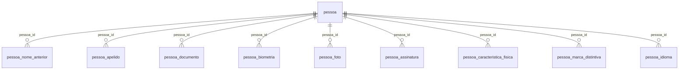

### `pessoa_nome_anterior`

> Nomes anteriores da persona (retificação civil, casamento etc).

| Coluna | Tipo | Nulo | FK | Constraints |
|---|---|:---:|---|---|
| `id` | `UUID` | NO |  | PK |
| `pessoa_id` | `UUID` | NO | `pessoa(id)` |  |
| `nome_antigo` | `TEXT` | NO |  |  |
| `motivo_mudanca` | `TEXT` | YES |  |  |
| `data_mudanca` | `DATE` | YES |  |  |

### `pessoa_apelido`

> Apelidos/fuãs informais usados pela persona.

| Coluna | Tipo | Nulo | FK | Constraints |
|---|---|:---:|---|---|
| `id` | `UUID` | NO |  | PK |
| `pessoa_id` | `UUID` | NO | `pessoa(id)` |  |
| `apelido` | `TEXT` | NO |  |  |
| `origem` | `TEXT` | YES |  |  |
| `contexto_uso` | `TEXT` | YES |  |  |

### `pessoa_documento`

> Documentos fictícios com numeração própria (sem dados reais).

| Coluna | Tipo | Nulo | FK | Constraints |
|---|---|:---:|---|---|
| `id` | `UUID` | NO |  | PK |
| `pessoa_id` | `UUID` | NO | `pessoa(id)` |  |
| `tipo` | `TEXT` | NO |  |  |
| `numero_ficticio` | `TEXT` | NO |  |  |
| `orgao_emissor` | `TEXT` | YES |  |  |
| `validade` | `DATE` | YES |  |  |

### `pessoa_biometria`

> Biometria 100% fictícia, derivada deterministicamente da persona.

| Coluna | Tipo | Nulo | FK | Constraints |
|---|---|:---:|---|---|
| `id` | `UUID` | NO |  | PK |
| `pessoa_id` | `UUID` | NO | `pessoa(id)` |  |
| `impressao_digital_ficticia` | `TEXT` | NO |  |  |
| `padrao_iris_ficticio` | `TEXT` | NO |  |  |
| `hash_facial_ficticio` | `TEXT` | NO |  |  |

### `pessoa_foto`

> URLs fictícias de fotos (nunca apontam para pessoas reais).

| Coluna | Tipo | Nulo | FK | Constraints |
|---|---|:---:|---|---|
| `id` | `UUID` | NO |  | PK |
| `pessoa_id` | `UUID` | NO | `pessoa(id)` |  |
| `url_ficticia` | `TEXT` | NO |  |  |
| `data` | `DATE` | YES |  |  |
| `contexto` | `TEXT` | YES |  |  |

### `pessoa_assinatura`

> Modelo de assinatura fictício.

| Coluna | Tipo | Nulo | FK | Constraints |
|---|---|:---:|---|---|
| `id` | `UUID` | NO |  | PK |
| `pessoa_id` | `UUID` | NO | `pessoa(id)` |  |
| `modelo_assinatura` | `TEXT` | NO |  |  |
| `data_registro` | `DATE` | YES |  |  |

### `pessoa_caracteristica_fisica`

> Fenótipos físicos herdados (ver engines/genetics.py).

| Coluna | Tipo | Nulo | FK | Constraints |
|---|---|:---:|---|---|
| `id` | `UUID` | NO |  | PK |
| `pessoa_id` | `UUID` | NO | `pessoa(id)` |  |
| `altura` | `NUMERIC(5,2)` | YES |  | CHECK (altura BETWEEN 1.20 AND 2.40) |
| `peso` | `NUMERIC(5,2)` | YES |  | CHECK (peso BETWEEN 25.0 AND 300.0) |
| `cor_olhos` | `TEXT` | YES |  |  |
| `cor_cabelo` | `TEXT` | YES |  |  |
| `mao_dominante` | `TEXT` | YES |  | CHECK (mao_dominante IN ('destra', 'canhota', 'ambidestra')) |
| `tipo_sanguineo` | `TEXT` | YES |  | CHECK (tipo_sanguineo IN ('A','B','AB','O')) |
| `fator_rh` | `TEXT` | YES |  | CHECK (fator_rh IN ('positivo','negativo')) |

### `pessoa_marca_distintiva`

> Marcas corporais distintivas fictícias.

| Coluna | Tipo | Nulo | FK | Constraints |
|---|---|:---:|---|---|
| `id` | `UUID` | NO |  | PK |
| `pessoa_id` | `UUID` | NO | `pessoa(id)` |  |
| `tipo` | `TEXT` | YES |  | CHECK (tipo IN ('tatuagem','cicatriz','sinal','pintinha','protesis')) |
| `localizacao_corporal` | `TEXT` | YES |  |  |
| `descricao` | `TEXT` | YES |  |  |
| `data_aquisicao` | `DATE` | YES |  |  |

### `pessoa_idioma`

> Idiomas falados pela persona.

| Coluna | Tipo | Nulo | FK | Constraints |
|---|---|:---:|---|---|
| `id` | `UUID` | NO |  | PK |
| `pessoa_id` | `UUID` | NO | `pessoa(id)` |  |
| `idioma` | `TEXT` | NO |  |  |
| `nivel_fluencia` | `TEXT` | YES |  | CHECK (nivel_fluencia IN ('basico','intermediario','avancado','fluente','nativo')) |
| `forma_aprendizado` | `TEXT` | YES |  |  |

## Domínio `02_genealogia`

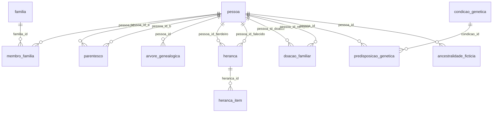

### `familia`

> Hub de núcleos familiares fictícios.

| Coluna | Tipo | Nulo | FK | Constraints |
|---|---|:---:|---|---|
| `id` | `UUID` | NO |  | PK |
| `sobrenome_familiar` | `TEXT` | NO |  |  |
| `origem_ficticia` | `TEXT` | YES |  |  |

### `membro_familia`

> Vínculo persona <-> família.

| Coluna | Tipo | Nulo | FK | Constraints |
|---|---|:---:|---|---|
| `id` | `UUID` | NO |  | PK |
| `pessoa_id` | `UUID` | NO | `pessoa(id)` |  |
| `familia_id` | `UUID` | NO | `familia(id)` |  |
| `papel_familiar` | `TEXT,` | YES |  |  |

### `parentesco`

> Grafo de parentesco entre personas.

| Coluna | Tipo | Nulo | FK | Constraints |
|---|---|:---:|---|---|
| `id` | `UUID` | NO |  | PK |
| `pessoa_id_a` | `UUID` | NO | `pessoa(id)` |  |
| `pessoa_id_b` | `UUID` | NO | `pessoa(id)` |  |
| `tipo_parentesco` | `TEXT` | NO |  |  |
| `grau` | `INTEGER` | YES |  | CHECK (grau BETWEEN 1 AND 20) |

### `arvore_genealogica`

> Posição de cada persona na árvore genealógica.

| Coluna | Tipo | Nulo | FK | Constraints |
|---|---|:---:|---|---|
| `id` | `UUID` | NO |  | PK |
| `pessoa_id` | `UUID` | NO | `pessoa(id)` |  |
| `geracao` | `INTEGER` | NO |  |  |
| `ramo` | `TEXT` | YES |  | CHECK (ramo IN ('paterno','materno')) |

### `heranca`

> Heranças recebidas por personas fictícias.

| Coluna | Tipo | Nulo | FK | Constraints |
|---|---|:---:|---|---|
| `id` | `UUID` | NO |  | PK |
| `pessoa_id_herdeiro` | `UUID` | NO | `pessoa(id)` |  |
| `pessoa_id_falecido` | `UUID` | NO | `pessoa(id)` |  |
| `data` | `DATE` | YES |  |  |
| `origem` | `TEXT` | YES |  |  |

### `heranca_item`

> Bens que compõem a herança.

| Coluna | Tipo | Nulo | FK | Constraints |
|---|---|:---:|---|---|
| `id` | `UUID` | NO |  | PK |
| `heranca_id` | `UUID` | NO | `heranca(id)` |  |
| `tipo_bem` | `TEXT` | YES |  |  |
| `valor_estimado` | `NUMERIC(14,2)` | YES |  |  |
| `descricao` | `TEXT` | YES |  |  |

### `doacao_familiar`

> Doações entre membros da família.

| Coluna | Tipo | Nulo | FK | Constraints |
|---|---|:---:|---|---|
| `id` | `UUID` | NO |  | PK |
| `pessoa_id_doador` | `UUID` | NO | `pessoa(id)` |  |
| `pessoa_id_receptor` | `UUID` | NO | `pessoa(id)` |  |
| `item` | `TEXT` | YES |  |  |
| `data` | `DATE` | YES |  |  |
| `motivo` | `TEXT` | YES |  |  |

### `condicao_genetica`

> Catálogo de condições genéticas fictícias.

| Coluna | Tipo | Nulo | FK | Constraints |
|---|---|:---:|---|---|
| `id` | `UUID` | NO |  | PK |
| `nome_condicao_ficticia` | `TEXT` | NO |  |  |
| `linha_familiar` | `TEXT` | YES |  | CHECK (linha_familiar IN ('paterna','materna')) |
| `percentual_manifestacao` | `NUMERIC(5,2)` | YES |  | CHECK (percentual_manifestacao BETWEEN 0 AND 100) |

### `predisposicao_genetica`

> Predisposição individual a condições hereditárias.

| Coluna | Tipo | Nulo | FK | Constraints |
|---|---|:---:|---|---|
| `id` | `UUID` | NO |  | PK |
| `pessoa_id` | `UUID` | NO | `pessoa(id)` |  |
| `condicao_id` | `UUID` | NO | `condicao_genetica(id)` |  |
| `grau_predisposicao` | `NUMERIC(5,2)` | YES |  | CHECK (grau_predisposicao BETWEEN 0 AND 1) |

### `ancestralidade_ficticia`

> Composição ancestral fictícia (europeia/africana/indígena/etc).

| Coluna | Tipo | Nulo | FK | Constraints |
|---|---|:---:|---|---|
| `id` | `UUID` | NO |  | PK |
| `pessoa_id` | `UUID` | NO | `pessoa(id)` |  |
| `origem_percentual` | `NUMERIC(5,2)` | YES |  | CHECK (origem_percentual BETWEEN 0 AND 100) |
| `regiao_ficticia` | `TEXT` | YES |  |  |

## Domínio `03_saude`

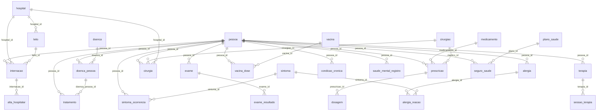

### `doenca`

> Catálogo de doenças fictícias (não corresponde a CID real).

| Coluna | Tipo | Nulo | FK | Constraints |
|---|---|:---:|---|---|
| `id` | `UUID` | NO |  | PK |
| `nome` | `TEXT` | NO |  |  |
| `categoria` | `TEXT` | YES |  |  |
| `gravidade_padrao` | `TEXT` | YES |  |  |

### `sintoma`

> Catálogo de sintomas fictícios.

| Coluna | Tipo | Nulo | FK | Constraints |
|---|---|:---:|---|---|
| `id` | `UUID` | NO |  | PK |
| `nome` | `TEXT` | NO |  |  |
| `categoria` | `TEXT` | YES |  |  |

### `medicamento`

> Medicamentos com nomes 100% fictícios.

| Coluna | Tipo | Nulo | FK | Constraints |
|---|---|:---:|---|---|
| `id` | `UUID` | NO |  | PK |
| `nome_ficticio` | `TEXT` | NO |  |  |
| `principio_ativo_ficticio` | `TEXT` | YES |  |  |

### `cirurgiao`

> Médicos cirurgiões fictícios.

| Coluna | Tipo | Nulo | FK | Constraints |
|---|---|:---:|---|---|
| `id` | `UUID` | NO |  | PK |
| `nome` | `TEXT` | NO |  |  |
| `especialidade` | `TEXT` | YES |  |  |

### `hospital`

> Hospitais fictícios.

| Coluna | Tipo | Nulo | FK | Constraints |
|---|---|:---:|---|---|
| `id` | `UUID` | NO |  | PK |
| `nome` | `TEXT` | NO |  |  |
| `endereco_id` | `UUID` | YES |  |  |
| `tipo` | `TEXT` | YES |  |  |

### `leito`

> Leitos por hospital.

| Coluna | Tipo | Nulo | FK | Constraints |
|---|---|:---:|---|---|
| `id` | `UUID` | NO |  | PK |
| `hospital_id` | `UUID` | NO | `hospital(id)` |  |
| `numero` | `TEXT` | YES |  |  |
| `ala` | `TEXT` | YES |  |  |

### `vacina`

> Catálogo de vacinas fictícias.

| Coluna | Tipo | Nulo | FK | Constraints |
|---|---|:---:|---|---|
| `id` | `UUID` | NO |  | PK |
| `nome` | `TEXT` | NO |  |  |
| `tipo` | `TEXT` | YES |  |  |

### `plano_saude`

> Planos de saúde fictícios.

| Coluna | Tipo | Nulo | FK | Constraints |
|---|---|:---:|---|---|
| `id` | `UUID` | NO |  | PK |
| `operadora` | `TEXT` | NO |  |  |
| `cobertura` | `TEXT` | YES |  |  |
| `mensalidade` | `NUMERIC(10,2)` | YES |  |  |

### `convenio`

> Convênios médicos fictícios.

| Coluna | Tipo | Nulo | FK | Constraints |
|---|---|:---:|---|---|
| `id` | `UUID` | NO |  | PK |
| `nome` | `TEXT` | NO |  |  |
| `hospitais_conveniados` | `INTEGER` | YES |  |  |

### `doenca_pessoa`

> Diagnósticos individuais de doenças.

| Coluna | Tipo | Nulo | FK | Constraints |
|---|---|:---:|---|---|
| `id` | `UUID` | NO |  | PK |
| `pessoa_id` | `UUID` | NO | `pessoa(id)` |  |
| `doenca_id` | `UUID` | NO | `doenca(id)` |  |
| `data_diagnostico` | `DATE` | YES |  |  |
| `estagio` | `TEXT` | YES |  |  |
| `status` | `TEXT` | YES |  | CHECK (status IN ('ativa','remissao','curada')) |

### `tratamento`

> Tratamentos associados a diagnósticos.

| Coluna | Tipo | Nulo | FK | Constraints |
|---|---|:---:|---|---|
| `id` | `UUID` | NO |  | PK |
| `pessoa_id` | `UUID` | NO | `pessoa(id)` |  |
| `doenca_pessoa_id` | `UUID` | NO | `doenca_pessoa(id)` |  |
| `tipo` | `TEXT` | YES |  |  |
| `data_inicio` | `DATE` | YES |  |  |
| `data_fim` | `DATE` | YES |  |  |

### `sintoma_ocorrencia`

> Episódios sintomáticos vividos pela persona.

| Coluna | Tipo | Nulo | FK | Constraints |
|---|---|:---:|---|---|
| `id` | `UUID` | NO |  | PK |
| `pessoa_id` | `UUID` | NO | `pessoa(id)` |  |
| `sintoma_id` | `UUID` | NO | `sintoma(id)` |  |
| `data_inicio` | `DATE` | YES |  |  |
| `intensidade` | `TEXT` | YES |  | CHECK (intensidade IN ('leve','moderado','intenso','severo')) |

### `exame`

> Exames médicos realizados (fictícios).

| Coluna | Tipo | Nulo | FK | Constraints |
|---|---|:---:|---|---|
| `id` | `UUID` | NO |  | PK |
| `pessoa_id` | `UUID` | NO | `pessoa(id)` |  |
| `tipo_exame` | `TEXT` | NO |  |  |
| `data` | `DATE` | YES |  |  |
| `local` | `TEXT` | YES |  |  |

### `exame_resultado`

> Resultado de parâmetros de exames (particionada por hash). Partições em 98_indexes.sql.

| Coluna | Tipo | Nulo | FK | Constraints |
|---|---|:---:|---|---|
| `id` | `UUID` | NO |  | PK |
| `exame_id` | `UUID` | NO | `exame(id)` |  |
| `parametro` | `TEXT` | NO |  |  |
| `valor` | `TEXT` | YES |  |  |
| `referencia` | `TEXT` | YES |  |  |

### `prescricao`

> Prescrições médicas fictícias.

| Coluna | Tipo | Nulo | FK | Constraints |
|---|---|:---:|---|---|
| `id` | `UUID` | NO |  | PK |
| `pessoa_id` | `UUID` | NO | `pessoa(id)` |  |
| `medicamento_id` | `UUID` | NO | `medicamento(id)` |  |
| `medico_id` | `UUID` | NO | `cirurgiao(id)` |  |
| `data` | `DATE` | YES |  |  |

### `dosagem`

> Posologia de cada prescrição.

| Coluna | Tipo | Nulo | FK | Constraints |
|---|---|:---:|---|---|
| `id` | `UUID` | NO |  | PK |
| `prescricao_id` | `UUID` | NO | `prescricao(id)` |  |
| `quantidade` | `NUMERIC(8,2)` | YES |  |  |
| `unidade` | `TEXT` | YES |  |  |
| `frequencia` | `TEXT` | YES |  |  |

### `cirurgia`

> Procedimentos cirúrgicos realizados.

| Coluna | Tipo | Nulo | FK | Constraints |
|---|---|:---:|---|---|
| `id` | `UUID` | NO |  | PK |
| `pessoa_id` | `UUID` | NO | `pessoa(id)` |  |
| `tipo` | `TEXT` | YES |  |  |
| `data` | `DATE` | YES |  |  |
| `cirurgiao_id` | `UUID` | NO | `cirurgiao(id)` |  |
| `hospital_id` | `UUID` | NO | `hospital(id)` |  |

### `internacao`

> Internações hospitalares.

| Coluna | Tipo | Nulo | FK | Constraints |
|---|---|:---:|---|---|
| `id` | `UUID` | NO |  | PK |
| `pessoa_id` | `UUID` | NO | `pessoa(id)` |  |
| `hospital_id` | `UUID` | NO | `hospital(id)` |  |
| `leito_id` | `UUID` | NO | `leito(id)` |  |
| `data_entrada` | `DATE` | YES |  |  |
| `data_saida` | `DATE` | YES |  |  |
| `motivo` | `TEXT` | YES |  |  |

### `alta_hospitalar`

> Registro de alta após internação.

| Coluna | Tipo | Nulo | FK | Constraints |
|---|---|:---:|---|---|
| `id` | `UUID` | NO |  | PK |
| `internacao_id` | `UUID` | NO | `internacao(id)` |  |
| `data` | `DATE` | YES |  |  |
| `condicao_saida` | `TEXT` | YES |  |  |

### `vacina_dose`

> Doses de vacinas recebidas pela persona.

| Coluna | Tipo | Nulo | FK | Constraints |
|---|---|:---:|---|---|
| `id` | `UUID` | NO |  | PK |
| `pessoa_id` | `UUID` | NO | `pessoa(id)` |  |
| `vacina_id` | `UUID` | NO | `vacina(id)` |  |
| `data` | `DATE` | YES |  |  |
| `dose_numero` | `INTEGER` | YES |  |  |
| `local_aplicacao` | `TEXT` | YES |  |  |

### `alergia`

> Alergias da persona.

| Coluna | Tipo | Nulo | FK | Constraints |
|---|---|:---:|---|---|
| `id` | `UUID` | NO |  | PK |
| `pessoa_id` | `UUID` | NO | `pessoa(id)` |  |
| `substancia` | `TEXT` | NO |  |  |
| `gravidade` | `TEXT` | YES |  | CHECK (gravidade IN ('leve','moderada','grave')) |

### `alergia_reacao`

> Reações alérgicas e tratamento.

| Coluna | Tipo | Nulo | FK | Constraints |
|---|---|:---:|---|---|
| `id` | `UUID` | NO |  | PK |
| `alergia_id` | `UUID` | NO | `alergia(id)` |  |
| `sintoma_id` | `UUID` | NO | `sintoma(id)` |  |
| `tratamento_aplicado` | `TEXT` | YES |  |  |

### `condicao_cronica`

> Condições crônicas em acompanhamento.

| Coluna | Tipo | Nulo | FK | Constraints |
|---|---|:---:|---|---|
| `id` | `UUID` | NO |  | PK |
| `pessoa_id` | `UUID` | NO | `pessoa(id)` |  |
| `nome` | `TEXT` | NO |  |  |
| `data_diagnostico` | `DATE` | YES |  |  |
| `controle_atual` | `TEXT` | YES |  |  |

### `saude_mental_registro`

> Registros de saúde mental fictícios.

| Coluna | Tipo | Nulo | FK | Constraints |
|---|---|:---:|---|---|
| `id` | `UUID` | NO |  | PK |
| `pessoa_id` | `UUID` | NO | `pessoa(id)` |  |
| `condicao_ficticia` | `TEXT` | NO |  |  |
| `data_inicio` | `DATE` | YES |  |  |
| `status` | `TEXT` | YES |  |  |

### `terapia`

> Terapias em curso (psicológica, fono, etc).

| Coluna | Tipo | Nulo | FK | Constraints |
|---|---|:---:|---|---|
| `id` | `UUID` | NO |  | PK |
| `pessoa_id` | `UUID` | NO | `pessoa(id)` |  |
| `tipo` | `TEXT` | YES |  |  |
| `terapeuta_id` | `UUID` | YES |  |  |
| `data_inicio` | `DATE` | YES |  |  |

### `sessao_terapia`

> Sessões individuais de terapia.

| Coluna | Tipo | Nulo | FK | Constraints |
|---|---|:---:|---|---|
| `id` | `UUID` | NO |  | PK |
| `terapia_id` | `UUID` | NO | `terapia(id)` |  |
| `data` | `DATE` | YES |  |  |
| `duracao` | `INTERVAL` | YES |  |  |
| `notas_ficticias` | `TEXT` | YES |  |  |

### `seguro_saude`

> Contratação de seguro/plano de saúde.

| Coluna | Tipo | Nulo | FK | Constraints |
|---|---|:---:|---|---|
| `id` | `UUID` | NO |  | PK |
| `pessoa_id` | `UUID` | NO | `pessoa(id)` |  |
| `plano_id` | `UUID` | NO | `plano_saude(id)` |  |
| `data_contratacao` | `DATE` | YES |  |  |

## Domínio `04_educacao`

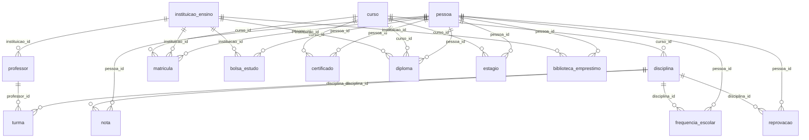

### `instituicao_ensino`

> Instituições de ensino fictícias.

| Coluna | Tipo | Nulo | FK | Constraints |
|---|---|:---:|---|---|
| `id` | `UUID` | NO |  | PK |
| `nome` | `TEXT` | NO |  |  |
| `tipo` | `TEXT` | YES |  | CHECK (tipo IN ('escola','colegio','faculdade','universidade','tecnico')) |
| `endereco_id` | `UUID` | YES |  |  |

### `curso`

> Cursos oferecidos (nível igual ao usado pelos engines).

| Coluna | Tipo | Nulo | FK | Constraints |
|---|---|:---:|---|---|
| `id` | `UUID` | NO |  | PK |
| `nome` | `TEXT` | NO |  |  |
| `nivel` | `TEXT` | YES |  | CHECK (nivel IN ('infantil','fundamental','medio','tecnico','superior','pos')) |
| `duracao_anos` | `INTEGER` | YES |  |  |

### `disciplina`

> Disciplinas vinculadas a cursos.

| Coluna | Tipo | Nulo | FK | Constraints |
|---|---|:---:|---|---|
| `id` | `UUID` | NO |  | PK |
| `nome` | `TEXT` | NO |  |  |
| `curso_id` | `UUID` | NO | `curso(id)` |  |
| `carga_horaria` | `INTEGER` | YES |  |  |

### `professor`

> Professores fictícios.

| Coluna | Tipo | Nulo | FK | Constraints |
|---|---|:---:|---|---|
| `id` | `UUID` | NO |  | PK |
| `nome` | `TEXT` | NO |  |  |
| `instituicao_id` | `UUID` | NO | `instituicao_ensino(id)` |  |
| `especialidade` | `TEXT` | YES |  |  |

### `turma`

> Turmas de uma disciplina com professor.

| Coluna | Tipo | Nulo | FK | Constraints |
|---|---|:---:|---|---|
| `id` | `UUID` | NO |  | PK |
| `disciplina_id` | `UUID` | NO | `disciplina(id)` |  |
| `professor_id` | `UUID` | NO | `professor(id)` |  |
| `periodo` | `TEXT` | YES |  |  |

### `matricula`

> Matrículas da persona em instituições.

| Coluna | Tipo | Nulo | FK | Constraints |
|---|---|:---:|---|---|
| `id` | `UUID` | NO |  | PK |
| `pessoa_id` | `UUID` | NO | `pessoa(id)` |  |
| `instituicao_id` | `UUID` | NO | `instituicao_ensino(id)` |  |
| `curso_id` | `UUID` | NO | `curso(id)` |  |
| `data_inicio` | `DATE` | YES |  |  |
| `data_fim` | `DATE` | YES |  |  |
| `status` | `TEXT` | YES |  | CHECK (status IN ('ativa','concluida','trancada','abandonada')) |

### `nota`

> Notas escolares por disciplina/periodo.

| Coluna | Tipo | Nulo | FK | Constraints |
|---|---|:---:|---|---|
| `id` | `UUID` | NO |  | PK |
| `pessoa_id` | `UUID` | NO | `pessoa(id)` |  |
| `disciplina_id` | `UUID` | NO | `disciplina(id)` |  |
| `periodo` | `TEXT` | YES |  |  |
| `valor` | `NUMERIC(4,2)` | YES |  | CHECK (valor BETWEEN 0 AND 10) |

### `frequencia_escolar`

> Frequência escolar da persona.

| Coluna | Tipo | Nulo | FK | Constraints |
|---|---|:---:|---|---|
| `id` | `UUID` | NO |  | PK |
| `pessoa_id` | `UUID` | NO | `pessoa(id)` |  |
| `disciplina_id` | `UUID` | NO | `disciplina(id)` |  |
| `periodo` | `TEXT` | YES |  |  |
| `percentual_presenca` | `NUMERIC(5,2)` | YES |  | CHECK (percentual_presenca BETWEEN 0 AND 100) |

### `bolsa_estudo`

> Bolsas de estudo concedidas.

| Coluna | Tipo | Nulo | FK | Constraints |
|---|---|:---:|---|---|
| `id` | `UUID` | NO |  | PK |
| `pessoa_id` | `UUID` | NO | `pessoa(id)` |  |
| `instituicao_id` | `UUID` | NO | `instituicao_ensino(id)` |  |
| `tipo` | `TEXT` | YES |  |  |
| `percentual` | `NUMERIC(5,2)` | YES |  | CHECK (percentual BETWEEN 0 AND 100) |
| `periodo` | `TEXT` | YES |  |  |

### `certificado`

> Certificados de conclusão de curso.

| Coluna | Tipo | Nulo | FK | Constraints |
|---|---|:---:|---|---|
| `id` | `UUID` | NO |  | PK |
| `pessoa_id` | `UUID` | NO | `pessoa(id)` |  |
| `curso_id` | `UUID` | NO | `curso(id)` |  |
| `data_emissao` | `DATE` | YES |  |  |

### `diploma`

> Diplomas de graduação/pós-graduação.

| Coluna | Tipo | Nulo | FK | Constraints |
|---|---|:---:|---|---|
| `id` | `UUID` | NO |  | PK |
| `pessoa_id` | `UUID` | NO | `pessoa(id)` |  |
| `curso_id` | `UUID` | NO | `curso(id)` |  |
| `data_conclusao` | `DATE` | YES |  |  |
| `instituicao_id` | `UUID` | NO | `instituicao_ensino(id)` |  |

### `reprovacao`

> Reprovações escolares.

| Coluna | Tipo | Nulo | FK | Constraints |
|---|---|:---:|---|---|
| `id` | `UUID` | NO |  | PK |
| `pessoa_id` | `UUID` | NO | `pessoa(id)` |  |
| `disciplina_id` | `UUID` | NO | `disciplina(id)` |  |
| `periodo` | `TEXT` | YES |  |  |
| `motivo` | `TEXT` | YES |  |  |

### `estagio`

> Estágios cursados (FK empresa resolvida em 05).

| Coluna | Tipo | Nulo | FK | Constraints |
|---|---|:---:|---|---|
| `id` | `UUID` | NO |  | PK |
| `pessoa_id` | `UUID` | NO | `pessoa(id)` |  |
| `empresa_id` | `UUID` | YES |  |  |
| `curso_id` | `UUID` | NO | `curso(id)` |  |
| `data_inicio` | `DATE` | YES |  |  |
| `data_fim` | `DATE` | YES |  |  |

### `biblioteca_emprestimo`

> Empréstimos de obras na biblioteca da instituição.

| Coluna | Tipo | Nulo | FK | Constraints |
|---|---|:---:|---|---|
| `id` | `UUID` | NO |  | PK |
| `pessoa_id` | `UUID` | NO | `pessoa(id)` |  |
| `instituicao_id` | `UUID` | NO | `instituicao_ensino(id)` |  |
| `titulo_obra` | `TEXT` | YES |  |  |
| `data_emprestimo` | `DATE` | YES |  |  |
| `data_devolucao` | `DATE` | YES |  |  |

## Domínio `05_carreira`

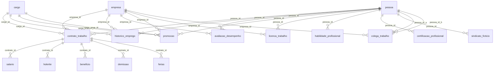

### `empresa`

> Empregadores fictícios com CNPJ sintético válido.

| Coluna | Tipo | Nulo | FK | Constraints |
|---|---|:---:|---|---|
| `id` | `UUID` | NO |  | PK |
| `nome` | `TEXT` | NO |  |  |
| `cnpj_ficticio` | `TEXT` | NO |  |  |
| `ramo_atividade` | `TEXT` | YES |  |  |
| `endereco_id` | `UUID` | YES |  |  |

### `cargo`

> Cargos fictícios com nível hierárquico.

| Coluna | Tipo | Nulo | FK | Constraints |
|---|---|:---:|---|---|
| `id` | `UUID` | NO |  | PK |
| `nome` | `TEXT` | NO |  |  |
| `nivel_hierarquico` | `INTEGER` | YES |  |  |

### `contrato_trabalho`

> Contratos de trabalho vigentes/históricos.

| Coluna | Tipo | Nulo | FK | Constraints |
|---|---|:---:|---|---|
| `id` | `UUID` | NO |  | PK |
| `pessoa_id` | `UUID` | NO | `pessoa(id)` |  |
| `empresa_id` | `UUID` | NO | `empresa(id)` |  |
| `cargo_id` | `UUID` | NO | `cargo(id)` |  |
| `tipo_contrato` | `TEXT` | YES |  | CHECK (tipo_contrato IN ('CLT','PJ','estagio','temporario','publico')) |
| `data_inicio` | `DATE` | YES |  |  |
| `data_fim` | `DATE` | YES |  |  |

### `historico_emprego`

> Linha do tempo dos empregos da persona.

| Coluna | Tipo | Nulo | FK | Constraints |
|---|---|:---:|---|---|
| `id` | `UUID` | NO |  | PK |
| `pessoa_id` | `UUID` | NO | `pessoa(id)` |  |
| `empresa_id` | `UUID` | NO | `empresa(id)` |  |
| `cargo_id` | `UUID` | NO | `cargo(id)` |  |
| `inicio` | `DATE` | YES |  |  |
| `fim` | `DATE` | YES |  |  |
| `motivo_saida` | `TEXT` | YES |  |  |

### `salario`

> Histórico salarial por contrato.

| Coluna | Tipo | Nulo | FK | Constraints |
|---|---|:---:|---|---|
| `id` | `UUID` | NO |  | PK |
| `contrato_id` | `UUID` | NO | `contrato_trabalho(id)` |  |
| `valor` | `NUMERIC(14,2)` | NO |  |  |
| `data_vigencia` | `DATE` | YES |  |  |

### `holerite`

> Holerites mensais fictícios.

| Coluna | Tipo | Nulo | FK | Constraints |
|---|---|:---:|---|---|
| `id` | `UUID` | NO |  | PK |
| `contrato_id` | `UUID` | NO | `contrato_trabalho(id)` |  |
| `mes_referencia` | `DATE` | YES |  |  |
| `valor_liquido` | `NUMERIC(14,2)` | YES |  |  |
| `descontos` | `NUMERIC(14,2)` | YES |  |  |

### `beneficio`

> Benefícios corporativos (VT, VA, plano, etc).

| Coluna | Tipo | Nulo | FK | Constraints |
|---|---|:---:|---|---|
| `id` | `UUID` | NO |  | PK |
| `contrato_id` | `UUID` | NO | `contrato_trabalho(id)` |  |
| `tipo` | `TEXT` | YES |  |  |
| `valor` | `NUMERIC(12,2)` | YES |  |  |

### `avaliacao_desempenho`

> Avaliações periódicas de desempenho.

| Coluna | Tipo | Nulo | FK | Constraints |
|---|---|:---:|---|---|
| `id` | `UUID` | NO |  | PK |
| `pessoa_id` | `UUID` | NO | `pessoa(id)` |  |
| `empresa_id` | `UUID` | NO | `empresa(id)` |  |
| `periodo` | `TEXT` | YES |  |  |
| `nota` | `NUMERIC(4,2)` | YES |  | CHECK (nota BETWEEN 0 AND 10) |
| `feedback_ficticio` | `TEXT` | YES |  |  |

### `promocao`

> Promoções de cargo.

| Coluna | Tipo | Nulo | FK | Constraints |
|---|---|:---:|---|---|
| `id` | `UUID` | NO |  | PK |
| `pessoa_id` | `UUID` | NO | `pessoa(id)` |  |
| `empresa_id` | `UUID` | NO | `empresa(id)` |  |
| `cargo_anterior_id` | `UUID` | NO | `cargo(id)` |  |
| `cargo_novo_id` | `UUID` | NO | `cargo(id)` |  |
| `data` | `DATE` | YES |  |  |

### `demissao`

> Desligamentos e rescisões.

| Coluna | Tipo | Nulo | FK | Constraints |
|---|---|:---:|---|---|
| `id` | `UUID` | NO |  | PK |
| `contrato_id` | `UUID` | NO | `contrato_trabalho(id)` |  |
| `data` | `DATE` | YES |  |  |
| `motivo` | `TEXT` | YES |  |  |
| `tipo` | `TEXT` | YES |  | CHECK (tipo IN ('justa_causa','sem_justa_causa','pedido')) |

### `ferias`

> Períodos de férias.

| Coluna | Tipo | Nulo | FK | Constraints |
|---|---|:---:|---|---|
| `id` | `UUID` | NO |  | PK |
| `contrato_id` | `UUID` | NO | `contrato_trabalho(id)` |  |
| `data_inicio` | `DATE` | YES |  |  |
| `data_fim` | `DATE` | YES |  |  |
| `dias` | `INTEGER` | YES |  |  |

### `licenca_trabalho`

> Licenças (saúde, maternidade, etc).

| Coluna | Tipo | Nulo | FK | Constraints |
|---|---|:---:|---|---|
| `id` | `UUID` | NO |  | PK |
| `pessoa_id` | `UUID` | NO | `pessoa(id)` |  |
| `empresa_id` | `UUID` | NO | `empresa(id)` |  |
| `tipo` | `TEXT` | YES |  |  |
| `data_inicio` | `DATE` | YES |  |  |
| `data_fim` | `DATE` | YES |  |  |

### `habilidade_profissional`

> Habilidades técnicas da persona.

| Coluna | Tipo | Nulo | FK | Constraints |
|---|---|:---:|---|---|
| `id` | `UUID` | NO |  | PK |
| `pessoa_id` | `UUID` | NO | `pessoa(id)` |  |
| `nome_habilidade` | `TEXT` | NO |  |  |
| `nivel` | `TEXT` | YES |  | CHECK (nivel IN ('basico','intermediario','avancado')) |

### `certificacao_profissional`

> Certificações profissionais.

| Coluna | Tipo | Nulo | FK | Constraints |
|---|---|:---:|---|---|
| `id` | `UUID` | NO |  | PK |
| `pessoa_id` | `UUID` | NO | `pessoa(id)` |  |
| `nome` | `TEXT` | NO |  |  |
| `orgao_emissor` | `TEXT` | YES |  |  |
| `validade` | `DATE` | YES |  |  |

### `sindicato_ficticio`

> Sindicatos de categoria fictícios.

| Coluna | Tipo | Nulo | FK | Constraints |
|---|---|:---:|---|---|
| `id` | `UUID` | NO |  | PK |
| `pessoa_id` | `UUID` | NO | `pessoa(id)` |  |
| `nome_sindicato` | `TEXT` | YES |  |  |
| `categoria` | `TEXT` | YES |  |  |

### `colega_trabalho`

> Relações de coleguismo no trabalho.

| Coluna | Tipo | Nulo | FK | Constraints |
|---|---|:---:|---|---|
| `id` | `UUID` | NO |  | PK |
| `pessoa_id_a` | `UUID` | NO | `pessoa(id)` |  |
| `pessoa_id_b` | `UUID` | NO | `pessoa(id)` |  |
| `empresa_id` | `UUID` | NO | `empresa(id)` |  |
| `periodo` | `TEXT` | YES |  |  |

## Domínio `06_financas`

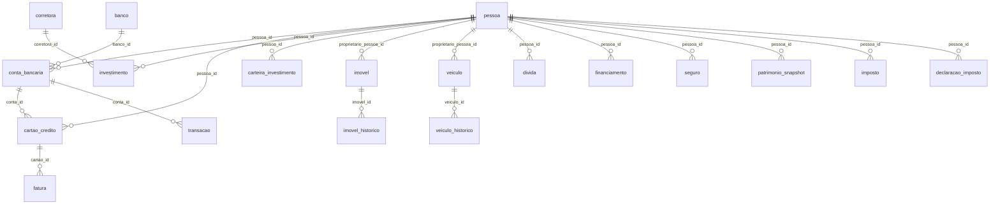

### `banco`

> Bancos fictícios.

| Coluna | Tipo | Nulo | FK | Constraints |
|---|---|:---:|---|---|
| `id` | `UUID` | NO |  | PK |
| `nome` | `TEXT` | NO |  |  |
| `codigo_ficticio` | `TEXT` | NO |  |  |

### `corretora`

> Corretoras de investimento fictícias.

| Coluna | Tipo | Nulo | FK | Constraints |
|---|---|:---:|---|---|
| `id` | `UUID` | NO |  | PK |
| `nome` | `TEXT` | NO |  |  |
| `tipo` | `TEXT` | YES |  |  |

### `conta_bancaria`

> Contas bancárias fictícias.

| Coluna | Tipo | Nulo | FK | Constraints |
|---|---|:---:|---|---|
| `id` | `UUID` | NO |  | PK |
| `pessoa_id` | `UUID` | NO | `pessoa(id)` |  |
| `banco_id` | `UUID` | NO | `banco(id)` |  |
| `tipo_conta` | `TEXT` | YES |  | CHECK (tipo_conta IN ('corrente','poupanca','salario','digital')) |
| `agencia` | `TEXT` | YES |  |  |
| `numero_ficticio` | `TEXT` | YES |  |  |

### `cartao_credito`

> Cartões de crédito fictícios.

| Coluna | Tipo | Nulo | FK | Constraints |
|---|---|:---:|---|---|
| `id` | `UUID` | NO |  | PK |
| `pessoa_id` | `UUID` | NO | `pessoa(id)` |  |
| `conta_id` | `UUID` | NO | `conta_bancaria(id)` |  |
| `bandeira` | `TEXT` | YES |  |  |
| `limite` | `NUMERIC(12,2)` | YES |  |  |

### `transacao`

> Transações financeiras fictícias (particionadas por ano). As partições concretas são criadas em 98_indexes.sql.

| Coluna | Tipo | Nulo | FK | Constraints |
|---|---|:---:|---|---|
| `id` | `UUID` | NO |  | PK |
| `conta_id` | `UUID` | NO | `conta_bancaria(id)` |  |
| `tipo` | `TEXT` | YES |  | CHECK (tipo IN ('debito','credito','pix','ted','doc','boleto')) |
| `valor` | `NUMERIC(14,2)` | NO |  |  |
| `data` | `TIMESTAMPTZ` | NO |  |  |
| `descricao` | `TEXT` | YES |  |  |

### `fatura`

> Faturas mensais de cartão.

| Coluna | Tipo | Nulo | FK | Constraints |
|---|---|:---:|---|---|
| `id` | `UUID` | NO |  | PK |
| `cartao_id` | `UUID` | NO | `cartao_credito(id)` |  |
| `mes_referencia` | `DATE` | YES |  |  |
| `valor_total` | `NUMERIC(12,2)` | YES |  |  |
| `status_pagamento` | `TEXT` | YES |  | CHECK (status_pagamento IN ('pago','pendente','atrasado')) |

### `investimento`

> Aplicações financeiras da persona.

| Coluna | Tipo | Nulo | FK | Constraints |
|---|---|:---:|---|---|
| `id` | `UUID` | NO |  | PK |
| `pessoa_id` | `UUID` | NO | `pessoa(id)` |  |
| `tipo` | `TEXT` | YES |  |  |
| `valor_aplicado` | `NUMERIC(14,2)` | YES |  |  |
| `data` | `DATE` | YES |  |  |
| `corretora_id` | `UUID` | NO | `corretora(id)` |  |

### `carteira_investimento`

> Snapshot periódico do patrimônio investido.

| Coluna | Tipo | Nulo | FK | Constraints |
|---|---|:---:|---|---|
| `id` | `UUID` | NO |  | PK |
| `pessoa_id` | `UUID` | NO | `pessoa(id)` |  |
| `valor_total` | `NUMERIC(16,2)` | YES |  |  |
| `data_snapshot` | `DATE` | YES |  |  |

### `imovel`

> Imóveis fictícios (FK endereco resolvida em 07).

| Coluna | Tipo | Nulo | FK | Constraints |
|---|---|:---:|---|---|
| `id` | `UUID` | NO |  | PK |
| `endereco_id` | `UUID` | YES |  |  |
| `tipo` | `TEXT` | YES |  |  |
| `valor_estimado` | `NUMERIC(14,2)` | YES |  |  |
| `proprietario_pessoa_id` | `UUID` | YES | `pessoa(id)` |  |

### `imovel_historico`

> Movimentações do imóvel.

| Coluna | Tipo | Nulo | FK | Constraints |
|---|---|:---:|---|---|
| `id` | `UUID` | NO |  | PK |
| `imovel_id` | `UUID` | NO | `imovel(id)` |  |
| `evento` | `TEXT` | YES |  | CHECK (evento IN ('compra','venda','reforma','doacao')) |
| `data` | `DATE` | YES |  |  |
| `valor` | `NUMERIC(14,2)` | YES |  |  |

### `veiculo`

> Veículos fictícios.

| Coluna | Tipo | Nulo | FK | Constraints |
|---|---|:---:|---|---|
| `id` | `UUID` | NO |  | PK |
| `modelo` | `TEXT` | NO |  |  |
| `ano` | `INTEGER` | YES |  |  |
| `placa_ficticia` | `TEXT` | NO |  |  |
| `proprietario_pessoa_id` | `UUID` | YES | `pessoa(id)` |  |

### `veiculo_historico`

> Eventos que marcaram o veículo.

| Coluna | Tipo | Nulo | FK | Constraints |
|---|---|:---:|---|---|
| `id` | `UUID` | NO |  | PK |
| `veiculo_id` | `UUID` | NO | `veiculo(id)` |  |
| `evento` | `TEXT` | YES |  | CHECK (evento IN ('compra','venda','acidente','manutencao')) |
| `data` | `DATE` | YES |  |  |
| `valor` | `NUMERIC(12,2)` | YES |  |  |

### `divida`

> Dívidas pessoais fictícias.

| Coluna | Tipo | Nulo | FK | Constraints |
|---|---|:---:|---|---|
| `id` | `UUID` | NO |  | PK |
| `pessoa_id` | `UUID` | NO | `pessoa(id)` |  |
| `credor` | `TEXT` | YES |  |  |
| `valor` | `NUMERIC(14,2)` | YES |  |  |
| `data_vencimento` | `DATE` | YES |  |  |
| `status` | `TEXT` | YES |  | CHECK (status IN ('em_aberto','paga','negociada','inadimplente')) |

### `financiamento`

> Financiamentos contratados.

| Coluna | Tipo | Nulo | FK | Constraints |
|---|---|:---:|---|---|
| `id` | `UUID` | NO |  | PK |
| `pessoa_id` | `UUID` | NO | `pessoa(id)` |  |
| `tipo` | `TEXT` | YES |  | CHECK (tipo IN ('imovel','veiculo','pessoal','estudo')) |
| `valor_total` | `NUMERIC(14,2)` | YES |  |  |
| `parcelas` | `INTEGER` | YES |  |  |
| `taxa_juros` | `NUMERIC(5,2)` | YES |  |  |

### `seguro`

> Apolícies de seguro contratadas.

| Coluna | Tipo | Nulo | FK | Constraints |
|---|---|:---:|---|---|
| `id` | `UUID` | NO |  | PK |
| `pessoa_id` | `UUID` | NO | `pessoa(id)` |  |
| `tipo` | `TEXT` | YES |  | CHECK (tipo IN ('vida','residencial','veicular','viagem','saude')) |
| `seguradora` | `TEXT` | YES |  |  |
| `valor_cobertura` | `NUMERIC(14,2)` | YES |  |  |

### `patrimonio_snapshot`

> Estimativa de patrimônio em datas.

| Coluna | Tipo | Nulo | FK | Constraints |
|---|---|:---:|---|---|
| `id` | `UUID` | NO |  | PK |
| `pessoa_id` | `UUID` | NO | `pessoa(id)` |  |
| `data` | `DATE` | YES |  |  |
| `valor_total_estimado` | `NUMERIC(16,2)` | YES |  |  |

### `imposto`

> Impostos declarados pela persona.

| Coluna | Tipo | Nulo | FK | Constraints |
|---|---|:---:|---|---|
| `id` | `UUID` | NO |  | PK |
| `pessoa_id` | `UUID` | NO | `pessoa(id)` |  |
| `tipo` | `TEXT` | YES |  |  |
| `ano_referencia` | `INTEGER` | YES |  |  |
| `valor` | `NUMERIC(14,2)` | YES |  |  |

### `declaracao_imposto`

> Declarações anuais de imposto de renda fictícias.

| Coluna | Tipo | Nulo | FK | Constraints |
|---|---|:---:|---|---|
| `id` | `UUID` | NO |  | PK |
| `pessoa_id` | `UUID` | NO | `pessoa(id)` |  |
| `ano` | `INTEGER` | YES |  |  |
| `status` | `TEXT` | YES |  | CHECK (status IN ('entregue','pendente','caiu_na_malha','restituida')) |
| `valor_restituicao_ou_debito` | `NUMERIC(14,2)` | YES |  |  |

## Domínio `07_residencia`

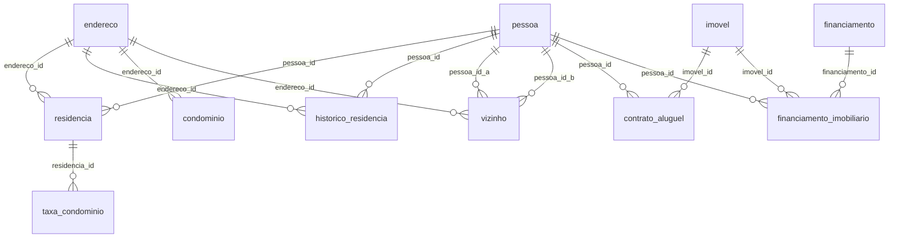

### `endereco`

> Endereços 100% fictícios.

| Coluna | Tipo | Nulo | FK | Constraints |
|---|---|:---:|---|---|
| `id` | `UUID` | NO |  | PK |
| `logradouro_ficticio` | `TEXT` | NO |  |  |
| `numero` | `TEXT` | YES |  |  |
| `bairro` | `TEXT` | YES |  |  |
| `cidade_ficticia` | `TEXT` | YES |  |  |
| `uf` | `CHAR(2)` | YES |  |  |
| `cep_ficticio` | `TEXT` | YES |  |  |

### `residencia`

> Residência atual da persona.

| Coluna | Tipo | Nulo | FK | Constraints |
|---|---|:---:|---|---|
| `id` | `UUID` | NO |  | PK |
| `pessoa_id` | `UUID` | NO | `pessoa(id)` |  |
| `endereco_id` | `UUID` | NO | `endereco(id)` |  |
| `tipo_posse` | `TEXT` | YES |  | CHECK (tipo_posse IN ('proprio','alugado','cedido','financiado')) |
| `data_entrada` | `DATE` | YES |  |  |

### `historico_residencia`

> Endereços anteriores da persona.

| Coluna | Tipo | Nulo | FK | Constraints |
|---|---|:---:|---|---|
| `id` | `UUID` | NO |  | PK |
| `pessoa_id` | `UUID` | NO | `pessoa(id)` |  |
| `endereco_id` | `UUID` | NO | `endereco(id)` |  |
| `data_entrada` | `DATE` | YES |  |  |
| `data_saida` | `DATE` | YES |  |  |
| `motivo_mudanca` | `TEXT` | YES |  |  |

### `condominio`

> Condomínios fictícios.

| Coluna | Tipo | Nulo | FK | Constraints |
|---|---|:---:|---|---|
| `id` | `UUID` | NO |  | PK |
| `nome` | `TEXT` | NO |  |  |
| `endereco_id` | `UUID` | NO | `endereco(id)` |  |
| `numero_unidades` | `INTEGER` | YES |  |  |

### `taxa_condominio`

> Taxas mensais de condomínio.

| Coluna | Tipo | Nulo | FK | Constraints |
|---|---|:---:|---|---|
| `id` | `UUID` | NO |  | PK |
| `residencia_id` | `UUID` | NO | `residencia(id)` |  |
| `mes_referencia` | `DATE` | YES |  |  |
| `valor` | `NUMERIC(10,2)` | YES |  |  |

### `vizinho`

> Relações de vizinhança entre personas.

| Coluna | Tipo | Nulo | FK | Constraints |
|---|---|:---:|---|---|
| `id` | `UUID` | NO |  | PK |
| `pessoa_id_a` | `UUID` | NO | `pessoa(id)` |  |
| `pessoa_id_b` | `UUID` | NO | `pessoa(id)` |  |
| `endereco_id` | `UUID` | NO | `endereco(id)` |  |
| `periodo_convivencia` | `TEXT` | YES |  |  |

### `contrato_aluguel`

> Contratos de locação residencial.

| Coluna | Tipo | Nulo | FK | Constraints |
|---|---|:---:|---|---|
| `id` | `UUID` | NO |  | PK |
| `pessoa_id` | `UUID` | NO | `pessoa(id)` |  |
| `imovel_id` | `UUID` | NO | `imovel(id)` |  |
| `valor_mensal` | `NUMERIC(12,2)` | YES |  |  |
| `data_inicio` | `DATE` | YES |  |  |
| `data_fim` | `DATE` | YES |  |  |

### `financiamento_imobiliario`

> Vínculo imóvel <-> financiamento imobiliário.

| Coluna | Tipo | Nulo | FK | Constraints |
|---|---|:---:|---|---|
| `id` | `UUID` | NO |  | PK |
| `pessoa_id` | `UUID` | NO | `pessoa(id)` |  |
| `imovel_id` | `UUID` | NO | `imovel(id)` |  |
| `financiamento_id` | `UUID` | NO | `financiamento(id)` |  |

## Domínio `08_relacionamentos`

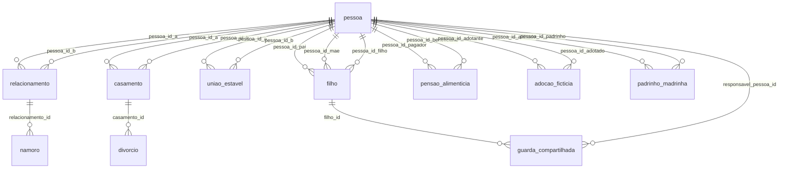

### `relacionamento`

> Relações interpessoais afetivas/amorosas.

| Coluna | Tipo | Nulo | FK | Constraints |
|---|---|:---:|---|---|
| `id` | `UUID` | NO |  | PK |
| `pessoa_id_a` | `UUID` | NO | `pessoa(id)` |  |
| `pessoa_id_b` | `UUID` | NO | `pessoa(id)` |  |
| `tipo` | `TEXT` | YES |  |  |
| `data_inicio` | `DATE` | YES |  |  |
| `data_fim` | `DATE` | YES |  |  |
| `status` | `TEXT` | YES |  | CHECK (status IN ('ativo','encerrado','pausado')) |

### `namoro`

> Datalhes de namoros.

| Coluna | Tipo | Nulo | FK | Constraints |
|---|---|:---:|---|---|
| `id` | `UUID` | NO |  | PK |
| `relacionamento_id` | `UUID` | NO | `relacionamento(id)` |  |
| `motivo_termino` | `TEXT` | YES |  |  |

### `casamento`

> Casamentos civis fictícios.

| Coluna | Tipo | Nulo | FK | Constraints |
|---|---|:---:|---|---|
| `id` | `UUID` | NO |  | PK |
| `pessoa_id_a` | `UUID` | NO | `pessoa(id)` |  |
| `pessoa_id_b` | `UUID` | NO | `pessoa(id)` |  |
| `data` | `DATE` | YES |  |  |
| `regime_bens` | `TEXT` | YES |  |  |

### `divorcio`

> Divórcios.

| Coluna | Tipo | Nulo | FK | Constraints |
|---|---|:---:|---|---|
| `id` | `UUID` | NO |  | PK |
| `casamento_id` | `UUID` | NO | `casamento(id)` |  |
| `data` | `DATE` | YES |  |  |
| `motivo_ficticio` | `TEXT` | YES |  |  |

### `uniao_estavel`

> Uniões estáveis (escritura ou não).

| Coluna | Tipo | Nulo | FK | Constraints |
|---|---|:---:|---|---|
| `id` | `UUID` | NO |  | PK |
| `pessoa_id_a` | `UUID` | NO | `pessoa(id)` |  |
| `pessoa_id_b` | `UUID` | NO | `pessoa(id)` |  |
| `data_inicio` | `DATE` | YES |  |  |
| `data_reconhecimento` | `DATE` | YES |  |  |

### `filho`

> Filhos registrados por pai e mãe.

| Coluna | Tipo | Nulo | FK | Constraints |
|---|---|:---:|---|---|
| `id` | `UUID` | NO |  | PK |
| `pessoa_id_pai` | `UUID` | NO | `pessoa(id)` |  |
| `pessoa_id_mae` | `UUID` | NO | `pessoa(id)` |  |
| `pessoa_id_filho` | `UUID` | NO | `pessoa(id)` |  |
| `data_nascimento` | `DATE` | YES |  |  |

### `guarda_compartilhada`

> Guarda compartilhada de filhos.

| Coluna | Tipo | Nulo | FK | Constraints |
|---|---|:---:|---|---|
| `id` | `UUID` | NO |  | PK |
| `filho_id` | `UUID` | NO | `filho(id)` |  |
| `responsavel_pessoa_id` | `UUID` | NO | `pessoa(id)` |  |
| `percentual_tempo` | `NUMERIC(5,2)` | YES |  | CHECK (percentual_tempo BETWEEN 0 AND 100) |

### `pensao_alimenticia`

> Pensões alimentícias entre personas.

| Coluna | Tipo | Nulo | FK | Constraints |
|---|---|:---:|---|---|
| `id` | `UUID` | NO |  | PK |
| `pessoa_id_pagador` | `UUID` | NO | `pessoa(id)` |  |
| `pessoa_id_beneficiario` | `UUID` | NO | `pessoa(id)` |  |
| `valor_mensal` | `NUMERIC(12,2)` | YES |  |  |
| `data_inicio` | `DATE` | YES |  |  |

### `adocao_ficticia`

> Adoções (parentalidade não-biológica).

| Coluna | Tipo | Nulo | FK | Constraints |
|---|---|:---:|---|---|
| `id` | `UUID` | NO |  | PK |
| `pessoa_id_adotante` | `UUID` | NO | `pessoa(id)` |  |
| `pessoa_id_adotado` | `UUID` | NO | `pessoa(id)` |  |
| `data` | `DATE` | YES |  |  |

### `padrinho_madrinha`

> Padrinhos/madrinhas de batismo ou casamento.

| Coluna | Tipo | Nulo | FK | Constraints |
|---|---|:---:|---|---|
| `id` | `UUID` | NO |  | PK |
| `pessoa_id_afilhado` | `UUID` | NO | `pessoa(id)` |  |
| `pessoa_id_padrinho` | `UUID` | NO | `pessoa(id)` |  |
| `tipo` | `TEXT` | YES |  | CHECK (tipo IN ('batismo','casamento')) |

## Domínio `09_rede_social`

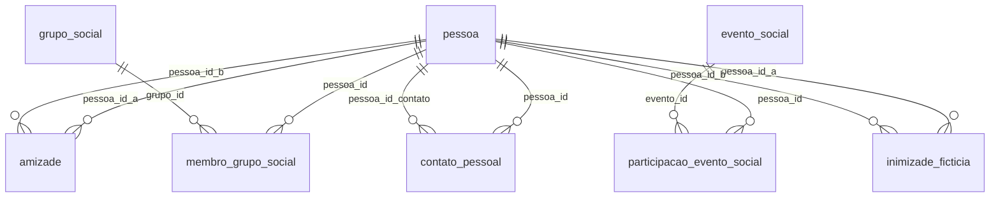

### `grupo_social`

> Grupos de convivência fictícios.

| Coluna | Tipo | Nulo | FK | Constraints |
|---|---|:---:|---|---|
| `id` | `UUID` | NO |  | PK |
| `nome` | `TEXT` | NO |  |  |
| `tipo` | `TEXT` | YES |  |  |
| `data_criacao` | `DATE` | YES |  |  |

### `evento_social`

> Eventos sociais (festa, encontro, evento).

| Coluna | Tipo | Nulo | FK | Constraints |
|---|---|:---:|---|---|
| `id` | `UUID` | NO |  | PK |
| `nome` | `TEXT` | NO |  |  |
| `data` | `TIMESTAMPTZ` | YES |  |  |
| `local_endereco_id` | `UUID` | YES |  |  |

### `clube`

> Clubes recreativos/sociais fictícios.

| Coluna | Tipo | Nulo | FK | Constraints |
|---|---|:---:|---|---|
| `id` | `UUID` | NO |  | PK |
| `nome` | `TEXT` | NO |  |  |
| `categoria` | `TEXT` | YES |  |  |

### `amizade`

> Laços de amizade entre personas.

| Coluna | Tipo | Nulo | FK | Constraints |
|---|---|:---:|---|---|
| `id` | `UUID` | NO |  | PK |
| `pessoa_id_a` | `UUID` | NO | `pessoa(id)` |  |
| `pessoa_id_b` | `UUID` | NO | `pessoa(id)` |  |
| `data_inicio` | `DATE` | YES |  |  |
| `contexto_conhecimento` | `TEXT` | YES |  |  |

### `membro_grupo_social`

> Participação de personas em grupos.

| Coluna | Tipo | Nulo | FK | Constraints |
|---|---|:---:|---|---|
| `id` | `UUID` | NO |  | PK |
| `pessoa_id` | `UUID` | NO | `pessoa(id)` |  |
| `grupo_id` | `UUID` | NO | `grupo_social(id)` |  |
| `data_entrada` | `DATE` | YES |  |  |
| `papel` | `TEXT` | YES |  |  |

### `participacao_evento_social`

> Presença de personas em eventos.

| Coluna | Tipo | Nulo | FK | Constraints |
|---|---|:---:|---|---|
| `id` | `UUID` | NO |  | PK |
| `pessoa_id` | `UUID` | NO | `pessoa(id)` |  |
| `evento_id` | `UUID` | NO | `evento_social(id)` |  |
| `papel` | `TEXT` | YES |  | CHECK (papel IN ('convidado','organizador','palestrante')) |

### `contato_pessoal`

> Agenda de contatos da persona.

| Coluna | Tipo | Nulo | FK | Constraints |
|---|---|:---:|---|---|
| `id` | `UUID` | NO |  | PK |
| `pessoa_id` | `UUID` | NO | `pessoa(id)` |  |
| `pessoa_id_contato` | `UUID` | NO | `pessoa(id)` |  |
| `frequencia_contato` | `TEXT` | YES |  |  |
| `tipo_vinculo` | `TEXT` | YES |  |  |

### `inimizade_ficticia`

> Conflitos interpessoais fictícios.

| Coluna | Tipo | Nulo | FK | Constraints |
|---|---|:---:|---|---|
| `id` | `UUID` | NO |  | PK |
| `pessoa_id_a` | `UUID` | NO | `pessoa(id)` |  |
| `pessoa_id_b` | `UUID` | NO | `pessoa(id)` |  |
| `motivo` | `TEXT` | YES |  |  |
| `data_inicio` | `DATE` | YES |  |  |

## Domínio `10_vida_digital`

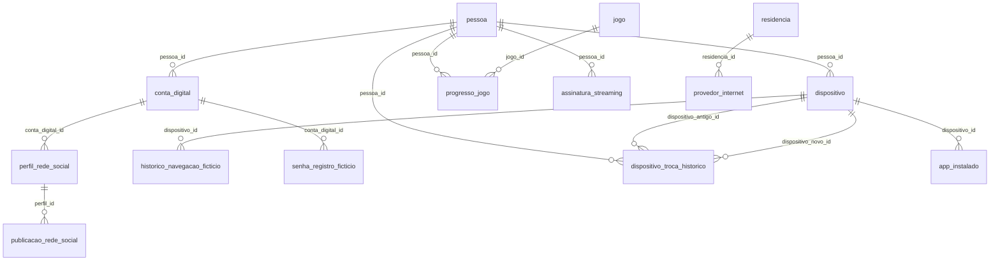

### `dispositivo`

> Dispositivos eletrônicos da persona.

| Coluna | Tipo | Nulo | FK | Constraints |
|---|---|:---:|---|---|
| `id` | `UUID` | NO |  | PK |
| `pessoa_id` | `UUID` | NO | `pessoa(id)` |  |
| `tipo` | `TEXT` | YES |  | CHECK (tipo IN ('celular','tablet','notebook','desktop','smarttv','smartwatch')) |
| `modelo` | `TEXT` | YES |  |  |
| `sistema_operacional` | `TEXT` | YES |  |  |
| `data_aquisicao` | `DATE` | YES |  |  |

### `conta_digital`

> Contas em plataformas digitais fictícias.

| Coluna | Tipo | Nulo | FK | Constraints |
|---|---|:---:|---|---|
| `id` | `UUID` | NO |  | PK |
| `pessoa_id` | `UUID` | NO | `pessoa(id)` |  |
| `plataforma` | `TEXT` | NO |  |  |
| `username_ficticio` | `TEXT` | YES |  |  |
| `data_criacao` | `DATE` | YES |  |  |

### `perfil_rede_social`

> Perfis públicos em redes sociais.

| Coluna | Tipo | Nulo | FK | Constraints |
|---|---|:---:|---|---|
| `id` | `UUID` | NO |  | PK |
| `conta_digital_id` | `UUID` | NO | `conta_digital(id)` |  |
| `seguidores_ficticios` | `INTEGER` | YES |  |  |
| `bio_ficticia` | `TEXT` | YES |  |  |

### `publicacao_rede_social`

> Publicações e posts fictícios.

| Coluna | Tipo | Nulo | FK | Constraints |
|---|---|:---:|---|---|
| `id` | `UUID` | NO |  | PK |
| `perfil_id` | `UUID` | NO | `perfil_rede_social(id)` |  |
| `data` | `TIMESTAMPTZ` | YES |  |  |
| `tipo_conteudo` | `TEXT` | YES |  |  |
| `engajamento_ficticio` | `INTEGER` | YES |  |  |

### `historico_navegacao_ficticio`

> Registro de navegação fictício (sem URLs reais).

| Coluna | Tipo | Nulo | FK | Constraints |
|---|---|:---:|---|---|
| `id` | `UUID` | NO |  | PK |
| `dispositivo_id` | `UUID` | NO | `dispositivo(id)` |  |
| `dominio_visitado` | `TEXT` | YES |  |  |
| `data` | `TIMESTAMPTZ` | YES |  |  |
| `duracao` | `INTERVAL` | YES |  |  |

### `jogo`

> Jogos fictícios.

| Coluna | Tipo | Nulo | FK | Constraints |
|---|---|:---:|---|---|
| `id` | `UUID` | NO |  | PK |
| `nome` | `TEXT` | NO |  |  |
| `plataforma` | `TEXT` | YES |  |  |
| `genero` | `TEXT` | YES |  |  |

### `progresso_jogo`

> Aproveitamento da persona em jogos.

| Coluna | Tipo | Nulo | FK | Constraints |
|---|---|:---:|---|---|
| `id` | `UUID` | NO |  | PK |
| `pessoa_id` | `UUID` | NO | `pessoa(id)` |  |
| `jogo_id` | `UUID` | NO | `jogo(id)` |  |
| `horas_jogadas` | `INTEGER` | YES |  |  |
| `nivel_atual` | `INTEGER` | YES |  |  |
| `data_ultima_sessao` | `DATE` | YES |  |  |

### `assinatura_streaming`

> Assinaturas de streaming.

| Coluna | Tipo | Nulo | FK | Constraints |
|---|---|:---:|---|---|
| `id` | `UUID` | NO |  | PK |
| `pessoa_id` | `UUID` | NO | `pessoa(id)` |  |
| `servico` | `TEXT` | YES |  |  |
| `plano` | `TEXT` | YES |  |  |
| `data_inicio` | `DATE` | YES |  |  |
| `valor_mensal` | `NUMERIC(10,2)` | YES |  |  |

### `senha_registro_ficticio`

> Metadados de senha (nunca a senha real).

| Coluna | Tipo | Nulo | FK | Constraints |
|---|---|:---:|---|---|
| `id` | `UUID` | NO |  | PK |
| `conta_digital_id` | `UUID` | NO | `conta_digital(id)` |  |
| `data_ultima_troca` | `DATE` | YES |  |  |
| `forca_senha` | `TEXT` | YES |  | CHECK (forca_senha IN ('fraca','media','forte')) |

### `dispositivo_troca_historico`

> Troca de aparelhos ao longo do tempo.

| Coluna | Tipo | Nulo | FK | Constraints |
|---|---|:---:|---|---|
| `id` | `UUID` | NO |  | PK |
| `pessoa_id` | `UUID` | NO | `pessoa(id)` |  |
| `dispositivo_antigo_id` | `UUID` | NO | `dispositivo(id)` |  |
| `dispositivo_novo_id` | `UUID` | NO | `dispositivo(id)` |  |
| `data` | `DATE` | YES |  |  |
| `motivo` | `TEXT` | YES |  |  |

### `app_instalado`

> Aplicativos instalados por dispositivo.

| Coluna | Tipo | Nulo | FK | Constraints |
|---|---|:---:|---|---|
| `id` | `UUID` | NO |  | PK |
| `dispositivo_id` | `UUID` | NO | `dispositivo(id)` |  |
| `nome_app` | `TEXT` | NO |  |  |
| `data_instalacao` | `DATE` | YES |  |  |
| `categoria` | `TEXT` | YES |  |  |

### `provedor_internet`

> Internet contratada na residência.

| Coluna | Tipo | Nulo | FK | Constraints |
|---|---|:---:|---|---|
| `id` | `UUID` | NO |  | PK |
| `residencia_id` | `UUID` | NO | `residencia(id)` |  |
| `operadora` | `TEXT` | YES |  |  |
| `velocidade_contratada` | `TEXT` | YES |  |  |

## Domínio `11_juridico`

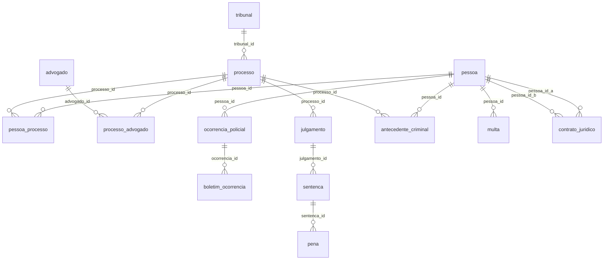

### `tribunal`

> Tribunais fictícios.

| Coluna | Tipo | Nulo | FK | Constraints |
|---|---|:---:|---|---|
| `id` | `UUID` | NO |  | PK |
| `nome_ficticio` | `TEXT` | NO |  |  |
| `jurisdicao` | `TEXT` | YES |  |  |

### `processo`

> Processos judiciais fictícios.

| Coluna | Tipo | Nulo | FK | Constraints |
|---|---|:---:|---|---|
| `id` | `UUID` | NO |  | PK |
| `numero_ficticio` | `TEXT` | NO |  |  |
| `tipo` | `TEXT` | YES |  |  |
| `tribunal_id` | `UUID` | NO | `tribunal(id)` |  |
| `status` | `TEXT` | YES |  | CHECK (status IN ('em_andamento','julgado','arquivado','suspenso')) |

### `pessoa_processo`

> Vínculo persona <-> processo.

| Coluna | Tipo | Nulo | FK | Constraints |
|---|---|:---:|---|---|
| `id` | `UUID` | NO |  | PK |
| `pessoa_id` | `UUID` | NO | `pessoa(id)` |  |
| `processo_id` | `UUID` | NO | `processo(id)` |  |
| `papel` | `TEXT` | YES |  | CHECK (papel IN ('reu','autor','testemunha','terceiro')) |

### `advogado`

> Advogados fictícios.

| Coluna | Tipo | Nulo | FK | Constraints |
|---|---|:---:|---|---|
| `id` | `UUID` | NO |  | PK |
| `nome` | `TEXT` | NO |  |  |
| `oab_ficticia` | `TEXT` | NO |  |  |

### `processo_advogado`

> Defesas e representações jurídicas.

| Coluna | Tipo | Nulo | FK | Constraints |
|---|---|:---:|---|---|
| `id` | `UUID` | NO |  | PK |
| `processo_id` | `UUID` | NO | `processo(id)` |  |
| `advogado_id` | `UUID` | NO | `advogado(id)` |  |
| `parte_representada` | `TEXT` | YES |  |  |

### `ocorrencia_policial`

> Ocorrências registradas (como vítima/envolvido).

| Coluna | Tipo | Nulo | FK | Constraints |
|---|---|:---:|---|---|
| `id` | `UUID` | NO |  | PK |
| `pessoa_id` | `UUID` | NO | `pessoa(id)` |  |
| `tipo` | `TEXT` | YES |  |  |
| `data` | `TIMESTAMPTZ` | YES |  |  |
| `local_endereco_id` | `UUID` | YES |  |  |

### `boletim_ocorrencia`

> Boletins de ocorrência fictícios.

| Coluna | Tipo | Nulo | FK | Constraints |
|---|---|:---:|---|---|
| `id` | `UUID` | NO |  | PK |
| `ocorrencia_id` | `UUID` | NO | `ocorrencia_policial(id)` |  |
| `numero_ficticio` | `TEXT` | NO |  |  |
| `delegacia` | `TEXT` | YES |  |  |

### `julgamento`

> Julgamentos do processo.

| Coluna | Tipo | Nulo | FK | Constraints |
|---|---|:---:|---|---|
| `id` | `UUID` | NO |  | PK |
| `processo_id` | `UUID` | NO | `processo(id)` |  |
| `data` | `DATE` | YES |  |  |
| `resultado` | `TEXT` | YES |  |  |

### `sentenca`

> Sentenças proferidas nos julgamentos.

| Coluna | Tipo | Nulo | FK | Constraints |
|---|---|:---:|---|---|
| `id` | `UUID` | NO |  | PK |
| `julgamento_id` | `UUID` | NO | `julgamento(id)` |  |
| `tipo` | `TEXT` | YES |  |  |
| `descricao` | `TEXT` | YES |  |  |

### `pena`

> Penas aplicadas conforme a sentença.

| Coluna | Tipo | Nulo | FK | Constraints |
|---|---|:---:|---|---|
| `id` | `UUID` | NO |  | PK |
| `sentenca_id` | `UUID` | NO | `sentenca(id)` |  |
| `tipo` | `TEXT` | YES |  | CHECK (tipo IN ('multa','prisao','prestacao_servico','restritiva')) |
| `duracao_ou_valor` | `TEXT` | YES |  |  |

### `antecedente_criminal`

> Antecedentes criminais da persona.

| Coluna | Tipo | Nulo | FK | Constraints |
|---|---|:---:|---|---|
| `id` | `UUID` | NO |  | PK |
| `pessoa_id` | `UUID` | NO | `pessoa(id)` |  |
| `processo_id` | `UUID` | NO | `processo(id)` |  |
| `status` | `TEXT` | YES |  | CHECK (status IN ('ativo','arquivado','sancionado')) |

### `multa`

> Multas aplicadas à persona.

| Coluna | Tipo | Nulo | FK | Constraints |
|---|---|:---:|---|---|
| `id` | `UUID` | NO |  | PK |
| `pessoa_id` | `UUID` | NO | `pessoa(id)` |  |
| `tipo` | `TEXT` | YES |  |  |
| `valor` | `NUMERIC(12,2)` | YES |  |  |
| `data` | `DATE` | YES |  |  |
| `status_pagamento` | `TEXT` | YES |  | CHECK (status_pagamento IN ('paga','pendente','recurso')) |

### `contrato_juridico`

> Contratos privados entre personas.

| Coluna | Tipo | Nulo | FK | Constraints |
|---|---|:---:|---|---|
| `id` | `UUID` | NO |  | PK |
| `pessoa_id_a` | `UUID` | NO | `pessoa(id)` |  |
| `pessoa_id_b` | `UUID` | NO | `pessoa(id)` |  |
| `tipo` | `TEXT` | YES |  |  |
| `data` | `DATE` | YES |  |  |
| `objeto` | `TEXT` | YES |  |  |

## Domínio `12_eleitoral`

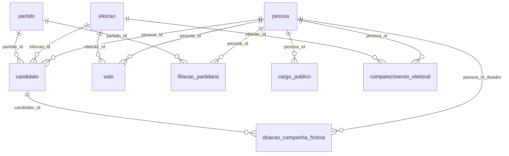

### `eleicao`

> Plebiscitos/eleições fictícias.

| Coluna | Tipo | Nulo | FK | Constraints |
|---|---|:---:|---|---|
| `id` | `UUID` | NO |  | PK |
| `ano` | `INTEGER` | NO |  |  |
| `tipo` | `TEXT` | YES |  | CHECK (tipo IN ('municipal','estadual','federal')) |
| `municipio_ficticio` | `TEXT` | YES |  |  |

### `partido`

> Partidos políticos 100% fictícios.

| Coluna | Tipo | Nulo | FK | Constraints |
|---|---|:---:|---|---|
| `id` | `UUID` | NO |  | PK |
| `nome_ficticio` | `TEXT` | NO |  |  |
| `sigla_ficticia` | `TEXT` | NO |  |  |

### `candidato`

> Candidaturas nas eleições.

| Coluna | Tipo | Nulo | FK | Constraints |
|---|---|:---:|---|---|
| `id` | `UUID` | NO |  | PK |
| `pessoa_id` | `UUID` | NO | `pessoa(id)` |  |
| `eleicao_id` | `UUID` | NO | `eleicao(id)` |  |
| `partido_id` | `UUID` | NO | `partido(id)` |  |
| `cargo_pretendido` | `TEXT` | YES |  |  |

### `voto`

> Votos computados (fictícios).

| Coluna | Tipo | Nulo | FK | Constraints |
|---|---|:---:|---|---|
| `id` | `UUID` | NO |  | PK |
| `pessoa_id` | `UUID` | NO | `pessoa(id)` |  |
| `eleicao_id` | `UUID` | NO | `eleicao(id)` |  |
| `candidato_id_escolhido` | `UUID` | YES |  |  |
| `tipo` | `TEXT` | YES |  | CHECK (tipo IN ('candidato','branco','nulo')) |

### `filiacao_partidaria`

> Filiações partidárias.

| Coluna | Tipo | Nulo | FK | Constraints |
|---|---|:---:|---|---|
| `id` | `UUID` | NO |  | PK |
| `pessoa_id` | `UUID` | NO | `pessoa(id)` |  |
| `partido_id` | `UUID` | NO | `partido(id)` |  |
| `data_filiacao` | `DATE` | YES |  |  |
| `data_desfiliacao` | `DATE` | YES |  |  |

### `cargo_publico`

> Cargos públicos ocupados pela persona.

| Coluna | Tipo | Nulo | FK | Constraints |
|---|---|:---:|---|---|
| `id` | `UUID` | NO |  | PK |
| `pessoa_id` | `UUID` | NO | `pessoa(id)` |  |
| `nome_cargo` | `TEXT` | NO |  |  |
| `orgao` | `TEXT` | YES |  |  |
| `data_inicio` | `DATE` | YES |  |  |
| `data_fim` | `DATE` | YES |  |  |

### `doacao_campanha_ficticia`

> Doações eleitorais fictícias.

| Coluna | Tipo | Nulo | FK | Constraints |
|---|---|:---:|---|---|
| `id` | `UUID` | NO |  | PK |
| `pessoa_id_doador` | `UUID` | NO | `pessoa(id)` |  |
| `candidato_id` | `UUID` | NO | `candidato(id)` |  |
| `valor` | `NUMERIC(12,2)` | YES |  |  |
| `data` | `DATE` | YES |  |  |

### `comparecimento_eleitoral`

> Comparecimento nas eleições.

| Coluna | Tipo | Nulo | FK | Constraints |
|---|---|:---:|---|---|
| `id` | `UUID` | NO |  | PK |
| `pessoa_id` | `UUID` | NO | `pessoa(id)` |  |
| `eleicao_id` | `UUID` | NO | `eleicao(id)` |  |
| `compareceu` | `BOOLEAN` | YES |  |  |
| `justificativa_ausencia` | `TEXT` | YES |  |  |

## Domínio `13_viagens`

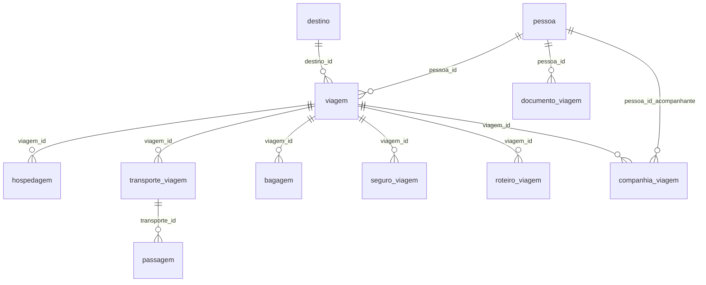

### `destino`

> Destinos de viagem 100% fictícios.

| Coluna | Tipo | Nulo | FK | Constraints |
|---|---|:---:|---|---|
| `id` | `UUID` | NO |  | PK |
| `cidade_ficticia` | `TEXT` | NO |  |  |
| `pais_ficticio` | `TEXT` | YES |  |  |

### `viagem`

> Viagens realizadas pela persona.

| Coluna | Tipo | Nulo | FK | Constraints |
|---|---|:---:|---|---|
| `id` | `UUID` | NO |  | PK |
| `pessoa_id` | `UUID` | NO | `pessoa(id)` |  |
| `destino_id` | `UUID` | NO | `destino(id)` |  |
| `data_ida` | `DATE` | YES |  |  |
| `data_volta` | `DATE` | YES |  |  |
| `motivo` | `TEXT` | YES |  |  |

### `hospedagem`

> Acomodações da viagem.

| Coluna | Tipo | Nulo | FK | Constraints |
|---|---|:---:|---|---|
| `id` | `UUID` | NO |  | PK |
| `viagem_id` | `UUID` | NO | `viagem(id)` |  |
| `tipo` | `TEXT` | YES |  | CHECK (tipo IN ('hotel','hostel','airbnb','pousada','familia')) |
| `nome_estabelecimento` | `TEXT` | YES |  |  |
| `custo` | `NUMERIC(12,2)` | YES |  |  |

### `transporte_viagem`

> Deslocamentos da viagem.

| Coluna | Tipo | Nulo | FK | Constraints |
|---|---|:---:|---|---|
| `id` | `UUID` | NO |  | PK |
| `viagem_id` | `UUID` | NO | `viagem(id)` |  |
| `tipo` | `TEXT` | YES |  | CHECK (tipo IN ('aereo','rodoviario','maritimo','ferroviario')) |
| `companhia` | `TEXT` | YES |  |  |

### `passagem`

> Passagens fictícias.

| Coluna | Tipo | Nulo | FK | Constraints |
|---|---|:---:|---|---|
| `id` | `UUID` | NO |  | PK |
| `transporte_id` | `UUID` | NO | `transporte_viagem(id)` |  |
| `numero_ficticio` | `TEXT` | NO |  |  |
| `classe` | `TEXT` | YES |  |  |
| `valor` | `NUMERIC(12,2)` | YES |  |  |

### `documento_viagem`

> Documentos necessários para viagens.

| Coluna | Tipo | Nulo | FK | Constraints |
|---|---|:---:|---|---|
| `id` | `UUID` | NO |  | PK |
| `pessoa_id` | `UUID` | NO | `pessoa(id)` |  |
| `tipo` | `TEXT` | YES |  | CHECK (tipo IN ('visto','passaporte')) |
| `validade` | `DATE` | YES |  |  |

### `bagagem`

> Bolsas/malas da viagem.

| Coluna | Tipo | Nulo | FK | Constraints |
|---|---|:---:|---|---|
| `id` | `UUID` | NO |  | PK |
| `viagem_id` | `UUID` | NO | `viagem(id)` |  |
| `tipo` | `TEXT` | YES |  |  |
| `peso` | `NUMERIC(6,2)` | YES |  |  |
| `extraviada` | `BOOLEAN` | YES |  |  |

### `seguro_viagem`

> Seguros contratados para a viagem.

| Coluna | Tipo | Nulo | FK | Constraints |
|---|---|:---:|---|---|
| `id` | `UUID` | NO |  | PK |
| `viagem_id` | `UUID` | NO | `viagem(id)` |  |
| `seguradora` | `TEXT` | YES |  |  |
| `cobertura` | `TEXT` | YES |  |  |

### `roteiro_viagem`

> Roteiro dia a dia da viagem.

| Coluna | Tipo | Nulo | FK | Constraints |
|---|---|:---:|---|---|
| `id` | `UUID` | NO |  | PK |
| `viagem_id` | `UUID` | NO | `viagem(id)` |  |
| `dia` | `INTEGER` | YES |  |  |
| `atividade_planejada` | `TEXT` | YES |  |  |

### `companhia_viagem`

> Acompanhantes na viagem.

| Coluna | Tipo | Nulo | FK | Constraints |
|---|---|:---:|---|---|
| `id` | `UUID` | NO |  | PK |
| `viagem_id` | `UUID` | NO | `viagem(id)` |  |
| `pessoa_id_acompanhante` | `UUID` | NO | `pessoa(id)` |  |

## Domínio `14_pets`

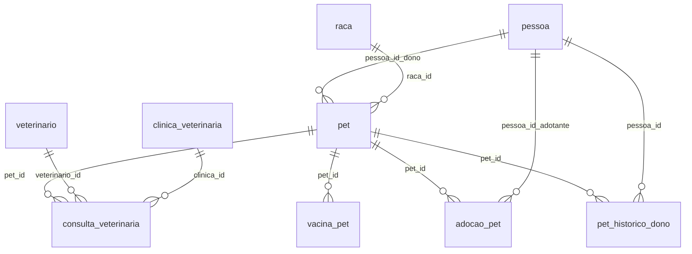

### `raca`

> Raças de animais fictícias.

| Coluna | Tipo | Nulo | FK | Constraints |
|---|---|:---:|---|---|
| `id` | `UUID` | NO |  | PK |
| `nome` | `TEXT` | NO |  |  |
| `especie` | `TEXT` | YES |  | CHECK (especie IN ('canina','felina','aves','roedores','peixes','repteis')) |

### `pet`

> Animais de estimação da persona.

| Coluna | Tipo | Nulo | FK | Constraints |
|---|---|:---:|---|---|
| `id` | `UUID` | NO |  | PK |
| `pessoa_id_dono` | `UUID` | NO | `pessoa(id)` |  |
| `nome` | `TEXT` | NO |  |  |
| `raca_id` | `UUID` | NO | `raca(id)` |  |
| `data_nascimento` | `DATE` | YES |  |  |

### `veterinario`

> Veterinários fictícios.

| Coluna | Tipo | Nulo | FK | Constraints |
|---|---|:---:|---|---|
| `id` | `UUID` | NO |  | PK |
| `nome` | `TEXT` | NO |  |  |
| `especialidade` | `TEXT` | YES |  |  |

### `clinica_veterinaria`

> Clínicas veterinárias fictícias.

| Coluna | Tipo | Nulo | FK | Constraints |
|---|---|:---:|---|---|
| `id` | `UUID` | NO |  | PK |
| `nome` | `TEXT` | NO |  |  |
| `endereco_id` | `UUID` | YES |  |  |

### `consulta_veterinaria`

> Consultas veterinárias do pet.

| Coluna | Tipo | Nulo | FK | Constraints |
|---|---|:---:|---|---|
| `id` | `UUID` | NO |  | PK |
| `pet_id` | `UUID` | NO | `pet(id)` |  |
| `veterinario_id` | `UUID` | NO | `veterinario(id)` |  |
| `clinica_id` | `UUID` | NO | `clinica_veterinaria(id)` |  |
| `data` | `DATE` | YES |  |  |
| `motivo` | `TEXT` | YES |  |  |

### `vacina_pet`

> Vacinas aplicadas nos pets.

| Coluna | Tipo | Nulo | FK | Constraints |
|---|---|:---:|---|---|
| `id` | `UUID` | NO |  | PK |
| `pet_id` | `UUID` | NO | `pet(id)` |  |
| `tipo_vacina` | `TEXT` | NO |  |  |
| `data` | `DATE` | YES |  |  |

### `adocao_pet`

> Adoções de animais.

| Coluna | Tipo | Nulo | FK | Constraints |
|---|---|:---:|---|---|
| `id` | `UUID` | NO |  | PK |
| `pet_id` | `UUID` | NO | `pet(id)` |  |
| `pessoa_id_adotante` | `UUID` | NO | `pessoa(id)` |  |
| `data` | `DATE` | YES |  |  |
| `origem` | `TEXT` | YES |  | CHECK (origem IN ('canil','resgate','loja','reatividade')) |

### `pet_historico_dono`

> Tutores anteriores do pet.

| Coluna | Tipo | Nulo | FK | Constraints |
|---|---|:---:|---|---|
| `id` | `UUID` | NO |  | PK |
| `pet_id` | `UUID` | NO | `pet(id)` |  |
| `pessoa_id` | `UUID` | NO | `pessoa(id)` |  |
| `data_inicio` | `DATE` | YES |  |  |
| `data_fim` | `DATE` | YES |  |  |
| `motivo_transferencia` | `TEXT` | YES |  |  |

## Domínio `15_consumo`

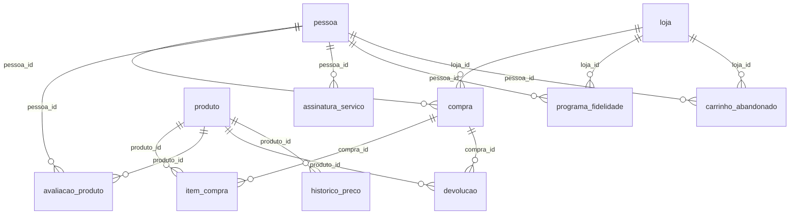

### `produto`

> Produtos de consumo fictícios.

| Coluna | Tipo | Nulo | FK | Constraints |
|---|---|:---:|---|---|
| `id` | `UUID` | NO |  | PK |
| `nome` | `TEXT` | NO |  |  |
| `categoria` | `TEXT` | YES |  |  |
| `marca_ficticia` | `TEXT` | YES |  |  |

### `loja`

> Lojas fictícias.

| Coluna | Tipo | Nulo | FK | Constraints |
|---|---|:---:|---|---|
| `id` | `UUID` | NO |  | PK |
| `nome` | `TEXT` | NO |  |  |
| `tipo` | `TEXT` | YES |  | CHECK (tipo IN ('fisica','online','marketplace')) |
| `endereco_id` | `UUID` | YES |  |  |

### `compra`

> Compras realizadas pela persona.

| Coluna | Tipo | Nulo | FK | Constraints |
|---|---|:---:|---|---|
| `id` | `UUID` | NO |  | PK |
| `pessoa_id` | `UUID` | NO | `pessoa(id)` |  |
| `loja_id` | `UUID` | NO | `loja(id)` |  |
| `data` | `DATE` | YES |  |  |
| `valor_total` | `NUMERIC(14,2)` | YES |  |  |

### `item_compra`

> Itens de cada compra.

| Coluna | Tipo | Nulo | FK | Constraints |
|---|---|:---:|---|---|
| `id` | `UUID` | NO |  | PK |
| `compra_id` | `UUID` | NO | `compra(id)` |  |
| `produto_id` | `UUID` | NO | `produto(id)` |  |
| `quantidade` | `INTEGER` | YES |  |  |
| `valor_unitario` | `NUMERIC(12,2)` | YES |  |  |

### `avaliacao_produto`

> Avaliações de produtos.

| Coluna | Tipo | Nulo | FK | Constraints |
|---|---|:---:|---|---|
| `id` | `UUID` | NO |  | PK |
| `pessoa_id` | `UUID` | NO | `pessoa(id)` |  |
| `produto_id` | `UUID` | NO | `produto(id)` |  |
| `nota` | `NUMERIC(4,2)` | YES |  | CHECK (nota BETWEEN 0 AND 10) |
| `comentario_ficticio` | `TEXT` | YES |  |  |

### `assinatura_servico`

> Assinaturas de serviços contínuos.

| Coluna | Tipo | Nulo | FK | Constraints |
|---|---|:---:|---|---|
| `id` | `UUID` | NO |  | PK |
| `pessoa_id` | `UUID` | NO | `pessoa(id)` |  |
| `servico` | `TEXT` | NO |  |  |
| `valor_mensal` | `NUMERIC(10,2)` | YES |  |  |
| `data_inicio` | `DATE` | YES |  |  |

### `devolucao`

> Devoluções de produtos.

| Coluna | Tipo | Nulo | FK | Constraints |
|---|---|:---:|---|---|
| `id` | `UUID` | NO |  | PK |
| `compra_id` | `UUID` | NO | `compra(id)` |  |
| `produto_id` | `UUID` | NO | `produto(id)` |  |
| `motivo` | `TEXT` | YES |  |  |
| `data` | `DATE` | YES |  |  |

### `programa_fidelidade`

> Pontos acumulados em programas de fidelidade.

| Coluna | Tipo | Nulo | FK | Constraints |
|---|---|:---:|---|---|
| `id` | `UUID` | NO |  | PK |
| `pessoa_id` | `UUID` | NO | `pessoa(id)` |  |
| `loja_id` | `UUID` | NO | `loja(id)` |  |
| `pontos_acumulados` | `INTEGER` | YES |  |  |

### `carrinho_abandonado`

> Carrinhos de compra abandonados.

| Coluna | Tipo | Nulo | FK | Constraints |
|---|---|:---:|---|---|
| `id` | `UUID` | NO |  | PK |
| `pessoa_id` | `UUID` | NO | `pessoa(id)` |  |
| `loja_id` | `UUID` | NO | `loja(id)` |  |
| `itens_ficticios` | `TEXT` | YES |  |  |
| `data` | `DATE` | YES |  |  |

### `historico_preco`

> Variação de preços ao longo do tempo.

| Coluna | Tipo | Nulo | FK | Constraints |
|---|---|:---:|---|---|
| `id` | `UUID` | NO |  | PK |
| `produto_id` | `UUID` | NO | `produto(id)` |  |
| `data` | `DATE` | YES |  |  |
| `valor` | `NUMERIC(12,2)` | YES |  |  |

## Domínio `16_timeline`

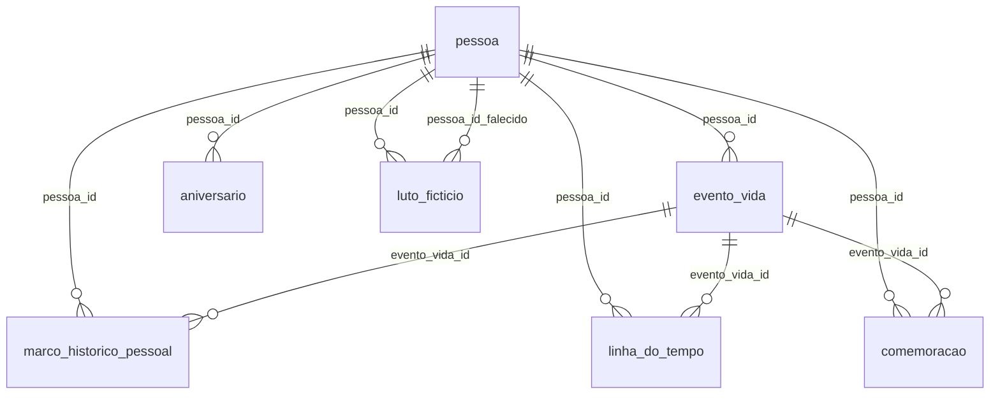

### `evento_vida`

> Eventos marcantes da vida da persona.

| Coluna | Tipo | Nulo | FK | Constraints |
|---|---|:---:|---|---|
| `id` | `UUID` | NO |  | PK |
| `pessoa_id` | `UUID` | NO | `pessoa(id)` |  |
| `data` | `DATE` | YES |  |  |
| `tipo_evento` | `TEXT` | YES |  |  |
| `descricao` | `TEXT` | YES |  |  |

### `marco_historico_pessoal`

> Marcos classificados por importância.

| Coluna | Tipo | Nulo | FK | Constraints |
|---|---|:---:|---|---|
| `id` | `UUID` | NO |  | PK |
| `pessoa_id` | `UUID` | NO | `pessoa(id)` |  |
| `evento_vida_id` | `UUID` | NO | `evento_vida(id)` |  |
| `importancia` | `INTEGER` | YES |  | CHECK (importancia BETWEEN 1 AND 10) |

### `linha_do_tempo`

> Ordem cronológica dos eventos de vida.

| Coluna | Tipo | Nulo | FK | Constraints |
|---|---|:---:|---|---|
| `id` | `UUID` | NO |  | PK |
| `pessoa_id` | `UUID` | NO | `pessoa(id)` |  |
| `evento_vida_id` | `UUID` | NO | `evento_vida(id)` |  |
| `ordem_cronologica` | `INTEGER` | YES |  |  |

### `aniversario`

> Datas comemorativas da persona.

| Coluna | Tipo | Nulo | FK | Constraints |
|---|---|:---:|---|---|
| `id` | `UUID` | NO |  | PK |
| `pessoa_id` | `UUID` | NO | `pessoa(id)` |  |
| `tipo` | `TEXT` | YES |  | CHECK (tipo IN ('nascimento','casamento','emprego','formatura')) |
| `data` | `DATE` | YES |  |  |

### `comemoracao`

> Festas ou homenagens por um evento.

| Coluna | Tipo | Nulo | FK | Constraints |
|---|---|:---:|---|---|
| `id` | `UUID` | NO |  | PK |
| `pessoa_id` | `UUID` | NO | `pessoa(id)` |  |
| `evento_vida_id` | `UUID` | NO | `evento_vida(id)` |  |
| `local_endereco_id` | `UUID` | YES |  |  |
| `convidados_ficticios` | `INTEGER` | YES |  |  |

### `luto_ficticio`

> Períodos de luto por falecimento de ente querido.

| Coluna | Tipo | Nulo | FK | Constraints |
|---|---|:---:|---|---|
| `id` | `UUID` | NO |  | PK |
| `pessoa_id` | `UUID` | NO | `pessoa(id)` |  |
| `pessoa_id_falecido` | `UUID` | NO | `pessoa(id)` |  |
| `data` | `DATE` | YES |  |  |
| `relacao` | `TEXT` | YES |  |  |

## Domínio `17_comportamento`

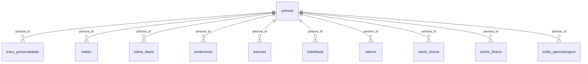

### `traco_personalidade`

> Traços de personalidade (ex.: Big Five fictício).

| Coluna | Tipo | Nulo | FK | Constraints |
|---|---|:---:|---|---|
| `id` | `UUID` | NO |  | PK |
| `pessoa_id` | `UUID` | NO | `pessoa(id)` |  |
| `nome_traco` | `TEXT` | NO |  |  |
| `intensidade` | `NUMERIC(5,2)` | YES |  | CHECK (intensidade BETWEEN 0 AND 10) |

### `habito`

> Hábitos cotidianos da persona.

| Coluna | Tipo | Nulo | FK | Constraints |
|---|---|:---:|---|---|
| `id` | `UUID` | NO |  | PK |
| `pessoa_id` | `UUID` | NO | `pessoa(id)` |  |
| `descricao` | `TEXT` | YES |  |  |
| `frequencia` | `TEXT` | YES |  |  |

### `rotina_diaria`

> Rotina diária típica da persona.

| Coluna | Tipo | Nulo | FK | Constraints |
|---|---|:---:|---|---|
| `id` | `UUID` | NO |  | PK |
| `pessoa_id` | `UUID` | NO | `pessoa(id)` |  |
| `horario` | `TIME` | YES |  |  |
| `atividade` | `TEXT` | YES |  |  |

### `preferencia`

> Preferências pessoais (comida, música, etc).

| Coluna | Tipo | Nulo | FK | Constraints |
|---|---|:---:|---|---|
| `id` | `UUID` | NO |  | PK |
| `pessoa_id` | `UUID` | NO | `pessoa(id)` |  |
| `categoria` | `TEXT` | YES |  |  |
| `item_preferido` | `TEXT` | YES |  |  |

### `aversao`

> Aversões pessoais.

| Coluna | Tipo | Nulo | FK | Constraints |
|---|---|:---:|---|---|
| `id` | `UUID` | NO |  | PK |
| `pessoa_id` | `UUID` | NO | `pessoa(id)` |  |
| `categoria` | `TEXT` | YES |  |  |
| `item_evitado` | `TEXT` | YES |  |  |

### `habilidade`

> Habilidades gerais da persona.

| Coluna | Tipo | Nulo | FK | Constraints |
|---|---|:---:|---|---|
| `id` | `UUID` | NO |  | PK |
| `pessoa_id` | `UUID` | NO | `pessoa(id)` |  |
| `nome` | `TEXT` | NO |  |  |
| `nivel` | `TEXT` | YES |  | CHECK (nivel IN ('basico','intermediario','avancado','especialista')) |

### `talento`

> Talentos naturais (nota fictícia 0-10).

| Coluna | Tipo | Nulo | FK | Constraints |
|---|---|:---:|---|---|
| `id` | `UUID` | NO |  | PK |
| `pessoa_id` | `UUID` | NO | `pessoa(id)` |  |
| `area` | `TEXT` | YES |  |  |
| `nivel_ficticio` | `NUMERIC(5,2)` | YES |  | CHECK (nivel_ficticio BETWEEN 0 AND 10) |

### `medo_ficticio`

> Fobias/medos fictícios.

| Coluna | Tipo | Nulo | FK | Constraints |
|---|---|:---:|---|---|
| `id` | `UUID` | NO |  | PK |
| `pessoa_id` | `UUID` | NO | `pessoa(id)` |  |
| `descricao` | `TEXT` | YES |  |  |
| `origem` | `TEXT` | YES |  |  |

### `sonho_ficticio`

> Aspirações e sonhos da persona.

| Coluna | Tipo | Nulo | FK | Constraints |
|---|---|:---:|---|---|
| `id` | `UUID` | NO |  | PK |
| `pessoa_id` | `UUID` | NO | `pessoa(id)` |  |
| `descricao` | `TEXT` | YES |  |  |
| `status` | `TEXT` | YES |  | CHECK (status IN ('realizado','em_curso','abandonado')) |

### `estilo_aprendizagem`

> Estilo dominante de aprendizagem.

| Coluna | Tipo | Nulo | FK | Constraints |
|---|---|:---:|---|---|
| `id` | `UUID` | NO |  | PK |
| `pessoa_id` | `UUID` | NO | `pessoa(id)` |  |
| `tipo` | `TEXT` | YES |  | CHECK (tipo IN ('visual','auditivo','cinestesico')) |

## Domínio `18_religiao`

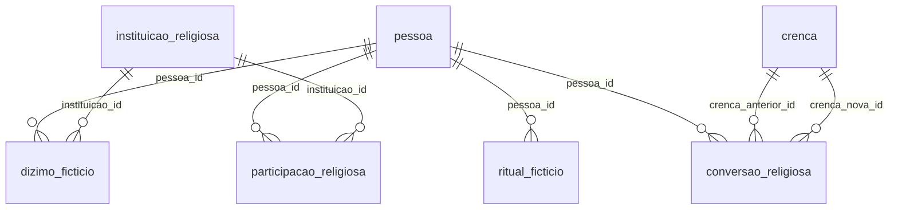

### `crenca`

> Crenças religiosas/espirituais fictícias (hub).

| Coluna | Tipo | Nulo | FK | Constraints |
|---|---|:---:|---|---|
| `id` | `UUID` | NO |  | PK |
| `nome_ficticio` | `TEXT` | NO |  |  |
| `intensidade` | `NUMERIC(5,2)` | YES |  | CHECK (intensidade BETWEEN 0 AND 10) |

### `instituicao_religiosa`

> Templos/igrejas fictícios.

| Coluna | Tipo | Nulo | FK | Constraints |
|---|---|:---:|---|---|
| `id` | `UUID` | NO |  | PK |
| `nome` | `TEXT` | NO |  |  |
| `endereco_id` | `UUID` | YES |  |  |

### `participacao_religiosa`

> Frequência religiosa da persona.

| Coluna | Tipo | Nulo | FK | Constraints |
|---|---|:---:|---|---|
| `id` | `UUID` | NO |  | PK |
| `pessoa_id` | `UUID` | NO | `pessoa(id)` |  |
| `instituicao_id` | `UUID` | NO | `instituicao_religiosa(id)` |  |
| `frequencia` | `TEXT` | YES |  |  |
| `papel` | `TEXT` | YES |  |  |

### `ritual_ficticio`

> Rituais praticados (batismo, cerimônias).

| Coluna | Tipo | Nulo | FK | Constraints |
|---|---|:---:|---|---|
| `id` | `UUID` | NO |  | PK |
| `pessoa_id` | `UUID` | NO | `pessoa(id)` |  |
| `nome` | `TEXT` | YES |  |  |
| `data` | `DATE` | YES |  |  |

### `conversao_religiosa`

> Mudanças de crença ao longo da vida.

| Coluna | Tipo | Nulo | FK | Constraints |
|---|---|:---:|---|---|
| `id` | `UUID` | NO |  | PK |
| `pessoa_id` | `UUID` | NO | `pessoa(id)` |  |
| `crenca_anterior_id` | `UUID` | NO | `crenca(id)` |  |
| `crenca_nova_id` | `UUID` | NO | `crenca(id)` |  |
| `data` | `DATE` | YES |  |  |

### `dizimo_ficticio`

> Contribuições financeiras regulares.

| Coluna | Tipo | Nulo | FK | Constraints |
|---|---|:---:|---|---|
| `id` | `UUID` | NO |  | PK |
| `pessoa_id` | `UUID` | NO | `pessoa(id)` |  |
| `instituicao_id` | `UUID` | NO | `instituicao_religiosa(id)` |  |
| `valor` | `NUMERIC(12,2)` | YES |  |  |
| `periodicidade` | `TEXT` | YES |  |  |

## Domínio `19_esporte`

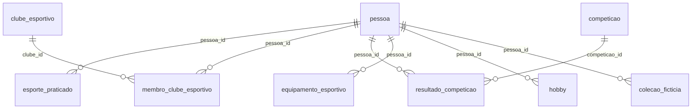

### `clube_esportivo`

> Clubes esportivos.

| Coluna | Tipo | Nulo | FK | Constraints |
|---|---|:---:|---|---|
| `id` | `UUID` | NO |  | PK |
| `nome` | `TEXT` | NO |  |  |
| `modalidade` | `TEXT` | YES |  |  |

### `competicao`

> Competições esportivas fictícias.

| Coluna | Tipo | Nulo | FK | Constraints |
|---|---|:---:|---|---|
| `id` | `UUID` | NO |  | PK |
| `nome` | `TEXT` | NO |  |  |
| `modalidade` | `TEXT` | YES |  |  |
| `data` | `DATE` | YES |  |  |

### `esporte_praticado`

> Esportes que a persona pratica.

| Coluna | Tipo | Nulo | FK | Constraints |
|---|---|:---:|---|---|
| `id` | `UUID` | NO |  | PK |
| `pessoa_id` | `UUID` | NO | `pessoa(id)` |  |
| `nome_esporte` | `TEXT` | NO |  |  |
| `nivel` | `TEXT` | YES |  |  |
| `frequencia` | `TEXT` | YES |  |  |

### `membro_clube_esportivo`

> Associação a clubes esportivos.

| Coluna | Tipo | Nulo | FK | Constraints |
|---|---|:---:|---|---|
| `id` | `UUID` | NO |  | PK |
| `pessoa_id` | `UUID` | NO | `pessoa(id)` |  |
| `clube_id` | `UUID` | NO | `clube_esportivo(id)` |  |
| `data_entrada` | `DATE` | YES |  |  |

### `resultado_competicao`

> Resultados da persona em competições.

| Coluna | Tipo | Nulo | FK | Constraints |
|---|---|:---:|---|---|
| `id` | `UUID` | NO |  | PK |
| `pessoa_id` | `UUID` | NO | `pessoa(id)` |  |
| `competicao_id` | `UUID` | NO | `competicao(id)` |  |
| `colocacao` | `INTEGER` | YES |  |  |

### `equipamento_esportivo`

> Equipamentos de esporte da persona.

| Coluna | Tipo | Nulo | FK | Constraints |
|---|---|:---:|---|---|
| `id` | `UUID` | NO |  | PK |
| `pessoa_id` | `UUID` | NO | `pessoa(id)` |  |
| `tipo` | `TEXT` | YES |  |  |
| `marca_ficticia` | `TEXT` | YES |  |  |
| `data_aquisicao` | `DATE` | YES |  |  |

### `hobby`

> Passatempos da persona.

| Coluna | Tipo | Nulo | FK | Constraints |
|---|---|:---:|---|---|
| `id` | `UUID` | NO |  | PK |
| `pessoa_id` | `UUID` | NO | `pessoa(id)` |  |
| `nome` | `TEXT` | NO |  |  |
| `frequencia` | `TEXT` | YES |  |  |

### `colecao_ficticia`

> Coleções particulares da persona.

| Coluna | Tipo | Nulo | FK | Constraints |
|---|---|:---:|---|---|
| `id` | `UUID` | NO |  | PK |
| `pessoa_id` | `UUID` | NO | `pessoa(id)` |  |
| `tema` | `TEXT` | YES |  |  |
| `quantidade_itens` | `INTEGER` | YES |  |  |

## Domínio `20_militar`

```mermaid
erDiagram
    pessoa ||--o{ servico_militar : "pessoa_id"
    servico_militar ||--o{ patente : "servico_militar_id"
    pessoa ||--o{ convocacao : "pessoa_id"
    servico_militar ||--o{ baixa_militar : "servico_militar_id"
    pessoa ||--o{ condecoracao_ficticia : "pessoa_id"
```

### `unidade_militar`

> Unidades militares fictícias.

| Coluna | Tipo | Nulo | FK | Constraints |
|---|---|:---:|---|---|
| `id` | `UUID` | NO |  | PK |
| `nome` | `TEXT` | NO |  |  |
| `localizacao_ficticia` | `TEXT` | YES |  |  |

### `servico_militar`

> Período de serviço militar/alistamento.

| Coluna | Tipo | Nulo | FK | Constraints |
|---|---|:---:|---|---|
| `id` | `UUID` | NO |  | PK |
| `pessoa_id` | `UUID` | NO | `pessoa(id)` |  |
| `data_inicio` | `DATE` | YES |  |  |
| `data_fim` | `DATE` | YES |  |  |
| `ramo` | `TEXT` | YES |  |  |

### `patente`

> Patentes alcançadas durante o serviço.

| Coluna | Tipo | Nulo | FK | Constraints |
|---|---|:---:|---|---|
| `id` | `UUID` | NO |  | PK |
| `servico_militar_id` | `UUID` | NO | `servico_militar(id)` |  |
| `nome_patente` | `TEXT` | YES |  |  |
| `data_promocao` | `DATE` | YES |  |  |

### `convocacao`

> Convocações militares fictícias.

| Coluna | Tipo | Nulo | FK | Constraints |
|---|---|:---:|---|---|
| `id` | `UUID` | NO |  | PK |
| `pessoa_id` | `UUID` | NO | `pessoa(id)` |  |
| `data` | `DATE` | YES |  |  |
| `motivo` | `TEXT` | YES |  |  |
| `resultado` | `TEXT` | YES |  | CHECK (resultado IN ('dispensado','incorporado','adiado')) |

### `baixa_militar`

> Baixa do serviço militar.

| Coluna | Tipo | Nulo | FK | Constraints |
|---|---|:---:|---|---|
| `id` | `UUID` | NO |  | PK |
| `servico_militar_id` | `UUID` | NO | `servico_militar(id)` |  |
| `data` | `DATE` | YES |  |  |
| `motivo` | `TEXT` | YES |  |  |

### `condecoracao_ficticia`

> Condecorações e honrarias recebidas.

| Coluna | Tipo | Nulo | FK | Constraints |
|---|---|:---:|---|---|
| `id` | `UUID` | NO |  | PK |
| `pessoa_id` | `UUID` | NO | `pessoa(id)` |  |
| `nome` | `TEXT` | YES |  |  |
| `data` | `DATE` | YES |  |  |

## Domínio `21_imigracao`

```mermaid
erDiagram
    pessoa ||--o{ documento_identidade : "pessoa_id"
    pessoa ||--o{ visto_ficticio : "pessoa_id"
    pessoa ||--o{ naturalizacao_ficticia : "pessoa_id"
    pessoa ||--o{ residencia_permanente_ficticia : "pessoa_id"
    pessoa ||--o{ deportacao_ficticia : "pessoa_id"
    pessoa ||--o{ fronteira_travessia_ficticia : "pessoa_id"
```

### `documento_identidade`

> Documentos emitidos por outros países (fictícios).

| Coluna | Tipo | Nulo | FK | Constraints |
|---|---|:---:|---|---|
| `id` | `UUID` | NO |  | PK |
| `pessoa_id` | `UUID` | NO | `pessoa(id)` |  |
| `tipo` | `TEXT` | YES |  |  |
| `pais_emissor_ficticio` | `TEXT` | YES |  |  |
| `validade` | `DATE` | YES |  |  |

### `visto_ficticio`

> Vistos concedidos à persona.

| Coluna | Tipo | Nulo | FK | Constraints |
|---|---|:---:|---|---|
| `id` | `UUID` | NO |  | PK |
| `pessoa_id` | `UUID` | NO | `pessoa(id)` |  |
| `pais_destino_ficticio` | `TEXT` | YES |  |  |
| `tipo` | `TEXT` | YES |  |  |
| `validade` | `DATE` | YES |  |  |

### `naturalizacao_ficticia`

> Processos de naturalização.

| Coluna | Tipo | Nulo | FK | Constraints |
|---|---|:---:|---|---|
| `id` | `UUID` | NO |  | PK |
| `pessoa_id` | `UUID` | NO | `pessoa(id)` |  |
| `pais_origem` | `TEXT` | YES |  |  |
| `pais_destino` | `TEXT` | YES |  |  |
| `data` | `DATE` | YES |  |  |

### `residencia_permanente_ficticia`

> Residências permanentes no exterior.

| Coluna | Tipo | Nulo | FK | Constraints |
|---|---|:---:|---|---|
| `id` | `UUID` | NO |  | PK |
| `pessoa_id` | `UUID` | NO | `pessoa(id)` |  |
| `pais` | `TEXT` | YES |  |  |
| `data_concessao` | `DATE` | YES |  |  |

### `deportacao_ficticia`

> Deportações da persona.

| Coluna | Tipo | Nulo | FK | Constraints |
|---|---|:---:|---|---|
| `id` | `UUID` | NO |  | PK |
| `pessoa_id` | `UUID` | NO | `pessoa(id)` |  |
| `pais` | `TEXT` | YES |  |  |
| `data` | `DATE` | YES |  |  |
| `motivo` | `TEXT` | YES |  |  |

### `fronteira_travessia_ficticia`

> Passagens de fronteira registradas.

| Coluna | Tipo | Nulo | FK | Constraints |
|---|---|:---:|---|---|
| `id` | `UUID` | NO |  | PK |
| `pessoa_id` | `UUID` | NO | `pessoa(id)` |  |
| `ponto_fronteira` | `TEXT` | YES |  |  |
| `data` | `DATE` | YES |  |  |
| `direcao` | `TEXT` | YES |  |  |

## Domínio `22_comunicacao`

```mermaid
erDiagram
    pessoa ||--o{ telefone : "pessoa_id"
    pessoa ||--o{ email : "pessoa_id"
    pessoa ||--o{ correspondencia : "pessoa_id_remetente"
    pessoa ||--o{ correspondencia : "pessoa_id_destinatario"
    pessoa ||--o{ ligacao_registro : "pessoa_id_a"
    pessoa ||--o{ ligacao_registro : "pessoa_id_b"
    pessoa ||--o{ mensagem_registro : "pessoa_id_a"
    pessoa ||--o{ mensagem_registro : "pessoa_id_b"
```

### `telefone`

> Telefones 100% fictícios.

| Coluna | Tipo | Nulo | FK | Constraints |
|---|---|:---:|---|---|
| `id` | `UUID` | NO |  | PK |
| `pessoa_id` | `UUID` | NO | `pessoa(id)` |  |
| `numero_ficticio` | `TEXT` | NO |  |  |
| `tipo` | `TEXT` | YES |  | CHECK (tipo IN ('fixo','celular')) |

### `email`

> E-mails fictícios.

| Coluna | Tipo | Nulo | FK | Constraints |
|---|---|:---:|---|---|
| `id` | `UUID` | NO |  | PK |
| `pessoa_id` | `UUID` | NO | `pessoa(id)` |  |
| `endereco_ficticio` | `TEXT` | NO |  |  |
| `provedor` | `TEXT` | YES |  |  |

### `correspondencia`

> Correspondências físicas trocadas.

| Coluna | Tipo | Nulo | FK | Constraints |
|---|---|:---:|---|---|
| `id` | `UUID` | NO |  | PK |
| `pessoa_id_remetente` | `UUID` | NO | `pessoa(id)` |  |
| `pessoa_id_destinatario` | `UUID` | NO | `pessoa(id)` |  |
| `tipo` | `TEXT` | YES |  |  |
| `data` | `DATE` | YES |  |  |

### `ligacao_registro`

> Registros de chamadas fictícios.

| Coluna | Tipo | Nulo | FK | Constraints |
|---|---|:---:|---|---|
| `id` | `UUID` | NO |  | PK |
| `pessoa_id_a` | `UUID` | NO | `pessoa(id)` |  |
| `pessoa_id_b` | `UUID` | NO | `pessoa(id)` |  |
| `data` | `TIMESTAMPTZ` | YES |  |  |
| `duracao` | `INTERVAL` | YES |  |  |

### `mensagem_registro`

> Registros de mensagens trocadas.

| Coluna | Tipo | Nulo | FK | Constraints |
|---|---|:---:|---|---|
| `id` | `UUID` | NO |  | PK |
| `pessoa_id_a` | `UUID` | NO | `pessoa(id)` |  |
| `pessoa_id_b` | `UUID` | NO | `pessoa(id)` |  |
| `plataforma` | `TEXT` | YES |  |  |
| `data` | `TIMESTAMPTZ` | YES |  |  |

## Domínio `23_midia`

```mermaid
erDiagram
    pessoa ||--o{ noticia_ficticia : "pessoa_id"
    pessoa ||--o{ mencao_midia : "pessoa_id"
    noticia_ficticia ||--o{ mencao_midia : "noticia_id"
    pessoa ||--o{ reputacao_score : "pessoa_id"
    pessoa ||--o{ premio_ficticio : "pessoa_id"
    pessoa ||--o{ entrevista_ficticia : "pessoa_id"
```

### `noticia_ficticia`

> Notícias fictícias sobre a persona.

| Coluna | Tipo | Nulo | FK | Constraints |
|---|---|:---:|---|---|
| `id` | `UUID` | NO |  | PK |
| `pessoa_id` | `UUID` | NO | `pessoa(id)` |  |
| `titulo` | `TEXT` | YES |  |  |
| `veiculo_ficticio` | `TEXT` | NO |  |  |
| `data` | `DATE` | YES |  |  |

### `mencao_midia`

> Menções da persona na mídia.

| Coluna | Tipo | Nulo | FK | Constraints |
|---|---|:---:|---|---|
| `id` | `UUID` | NO |  | PK |
| `pessoa_id` | `UUID` | NO | `pessoa(id)` |  |
| `noticia_id` | `UUID` | NO | `noticia_ficticia(id)` |  |
| `contexto` | `TEXT` | YES |  | CHECK (contexto IN ('positivo','negativo','neutro')) |

### `reputacao_score`

> Índice de reputação fictício ao longo do tempo.

| Coluna | Tipo | Nulo | FK | Constraints |
|---|---|:---:|---|---|
| `id` | `UUID` | NO |  | PK |
| `pessoa_id` | `UUID` | NO | `pessoa(id)` |  |
| `data` | `DATE` | YES |  |  |
| `valor_score` | `NUMERIC(5,2)` | YES |  | CHECK (valor_score BETWEEN 0 AND 100) |

### `premio_ficticio`

> Prêmios/honras recebidos.

| Coluna | Tipo | Nulo | FK | Constraints |
|---|---|:---:|---|---|
| `id` | `UUID` | NO |  | PK |
| `pessoa_id` | `UUID` | NO | `pessoa(id)` |  |
| `nome` | `TEXT` | YES |  |  |
| `categoria` | `TEXT` | YES |  |  |
| `data` | `DATE` | YES |  |  |

### `entrevista_ficticia`

> Entrevistas concedidas à mídia.

| Coluna | Tipo | Nulo | FK | Constraints |
|---|---|:---:|---|---|
| `id` | `UUID` | NO |  | PK |
| `pessoa_id` | `UUID` | NO | `pessoa(id)` |  |
| `veiculo_ficticio` | `TEXT` | NO |  |  |
| `data` | `DATE` | YES |  |  |
| `tema` | `TEXT` | YES |  |  |

## Domínio `24_meta`

```mermaid
erDiagram
    pessoa ||--o{ semente_aleatoria : "pessoa_id"
```

### `fonte_dado`

> Origem de cada bloco de dados gerado.

| Coluna | Tipo | Nulo | FK | Constraints |
|---|---|:---:|---|---|
| `id` | `UUID` | NO |  | PK |
| `tabela_origem` | `TEXT` | NO |  |  |
| `metodo_geracao` | `TEXT` | YES |  |  |
| `data_geracao` | `TIMESTAMPTZ` | YES |  |  |

### `versao_registro`

> Versionamento de registros gerados.

| Coluna | Tipo | Nulo | FK | Constraints |
|---|---|:---:|---|---|
| `id` | `UUID` | NO |  | PK |
| `tabela` | `TEXT` | NO |  |  |
| `registro_id` | `UUID` | YES |  |  |
| `numero_versao` | `INTEGER` | YES |  |  |
| `data` | `TIMESTAMPTZ` | YES |  |  |

### `log_alteracao`

> Histórico de alterações nos registros.

| Coluna | Tipo | Nulo | FK | Constraints |
|---|---|:---:|---|---|
| `id` | `UUID` | NO |  | PK |
| `tabela` | `TEXT` | YES |  |  |
| `registro_id` | `UUID` | YES |  |  |
| `campo_alterado` | `TEXT` | YES |  |  |
| `valor_antigo` | `TEXT` | YES |  |  |
| `valor_novo` | `TEXT` | YES |  |  |
| `data` | `TIMESTAMPTZ` | YES |  |  |

### `auditoria`

> Trilha de auditoria da geração.

| Coluna | Tipo | Nulo | FK | Constraints |
|---|---|:---:|---|---|
| `id` | `UUID` | NO |  | PK |
| `usuario_sistema` | `TEXT` | NO |  |  |
| `acao` | `TEXT` | YES |  |  |
| `tabela_afetada` | `TEXT` | YES |  |  |
| `data` | `TIMESTAMPTZ` | YES |  |  |

### `regra_geracao`

> Parâmetros de calibração usados na geração.

| Coluna | Tipo | Nulo | FK | Constraints |
|---|---|:---:|---|---|
| `id` | `UUID` | NO |  | PK |
| `dominio` | `TEXT` | NO |  |  |
| `parametro` | `TEXT` | YES |  |  |
| `valor_padrao` | `TEXT` | YES |  |  |

### `semente_aleatoria`

> Seed determinística usada para cada persona.

| Coluna | Tipo | Nulo | FK | Constraints |
|---|---|:---:|---|---|
| `id` | `UUID` | NO |  | PK |
| `pessoa_id` | `UUID` | YES | `pessoa(id)` |  |
| `seed_valor` | `TEXT` | NO |  |  |

### `validacao_consistencia`

> Registros de validações que falharam.

| Coluna | Tipo | Nulo | FK | Constraints |
|---|---|:---:|---|---|
| `id` | `UUID` | NO |  | PK |
| `tabela` | `TEXT` | YES |  |  |
| `regra_violada` | `TEXT` | YES |  |  |
| `registro_id` | `UUID` | YES |  |  |
| `data` | `TIMESTAMPTZ` | YES |  |  |

### `exportacao_dataset`

> Histórico de exportações geradas.

| Coluna | Tipo | Nulo | FK | Constraints |
|---|---|:---:|---|---|
| `id` | `UUID` | NO |  | PK |
| `data` | `TIMESTAMPTZ` | YES |  |  |
| `formato` | `TEXT` | YES |  |  |
| `tabelas_incluidas` | `TEXT` | YES |  |  |
| `destino` | `TEXT` | YES |  |  |

## Domínio `25_juncoes`

```mermaid
erDiagram
    pessoa ||--o{ pessoa_habilidade : "pessoa_id"
    habilidade ||--o{ pessoa_habilidade : "habilidade_id"
    pessoa ||--o{ pessoa_idioma_nivel : "pessoa_id"
    pessoa_idioma ||--o{ pessoa_idioma_nivel : "idioma_id"
    pessoa ||--o{ pessoa_hobby : "pessoa_id"
    hobby ||--o{ pessoa_hobby : "hobby_id"
    pessoa ||--o{ pessoa_grupo_social : "pessoa_id"
    grupo_social ||--o{ pessoa_grupo_social : "grupo_id"
    pessoa ||--o{ pessoa_evento : "pessoa_id"
    evento_social ||--o{ pessoa_evento : "evento_id"
    pessoa ||--o{ pessoa_doenca_familiar : "pessoa_id"
    condicao_genetica ||--o{ pessoa_doenca_familiar : "condicao_genetica_id"
    pessoa ||--o{ pessoa_pet : "pessoa_id"
    pet ||--o{ pessoa_pet : "pet_id"
    pessoa ||--o{ pessoa_veiculo : "pessoa_id"
    veiculo ||--o{ pessoa_veiculo : "veiculo_id"
    pessoa ||--o{ pessoa_imovel : "pessoa_id"
    imovel ||--o{ pessoa_imovel : "imovel_id"
    pessoa ||--o{ pessoa_processo : "pessoa_id"
    processo ||--o{ pessoa_processo : "processo_id"
    pessoa ||--o{ pessoa_eleicao : "pessoa_id"
    eleicao ||--o{ pessoa_eleicao : "eleicao_id"
    pessoa ||--o{ pessoa_viagem_companheiro : "pessoa_id"
    viagem ||--o{ pessoa_viagem_companheiro : "viagem_id"
    pessoa ||--o{ pessoa_empresa_socio : "pessoa_id"
    empresa ||--o{ pessoa_empresa_socio : "empresa_id"
    pessoa ||--o{ pessoa_religiao_historico : "pessoa_id"
    crenca ||--o{ pessoa_religiao_historico : "crenca_id"
    pessoa ||--o{ pessoa_documento_historico : "pessoa_id"
    pessoa_documento ||--o{ pessoa_documento_historico : "documento_id"
```

### `pessoa_habilidade`

> Junção persona <-> habilidade (domínio 17).

| Coluna | Tipo | Nulo | FK | Constraints |
|---|---|:---:|---|---|
| `pessoa_id` | `UUID` | NO | `pessoa(id)` |  |
| `habilidade_id` | `UUID` | NO | `habilidade(id)` |  |
| `nivel` | `TEXT` | YES |  |  |

### `pessoa_idioma_nivel`

> Níveis de leitura/fala por idioma (domínio 01).

| Coluna | Tipo | Nulo | FK | Constraints |
|---|---|:---:|---|---|
| `pessoa_id` | `UUID` | NO | `pessoa(id)` |  |
| `idioma_id` | `UUID` | NO | `pessoa_idioma(id)` |  |
| `nivel_leitura` | `TEXT` | YES |  |  |
| `nivel_fala` | `TEXT` | YES |  |  |

### `pessoa_hobby`

> Junção persona <-> hobby (domínio 19).

| Coluna | Tipo | Nulo | FK | Constraints |
|---|---|:---:|---|---|
| `pessoa_id` | `UUID` | NO | `pessoa(id)` |  |
| `hobby_id` | `UUID` | NO | `hobby(id)` |  |
| `desde_quando` | `DATE` | YES |  |  |

### `pessoa_grupo_social`

> Junção persona <-> grupo social (domínio 09).

| Coluna | Tipo | Nulo | FK | Constraints |
|---|---|:---:|---|---|
| `pessoa_id` | `UUID` | NO | `pessoa(id)` |  |
| `grupo_id` | `UUID` | NO | `grupo_social(id)` |  |
| `papel` | `TEXT` | YES |  |  |

### `pessoa_evento`

> Junção persona <-> evento social (domínio 09).

| Coluna | Tipo | Nulo | FK | Constraints |
|---|---|:---:|---|---|
| `pessoa_id` | `UUID` | NO | `pessoa(id)` |  |
| `evento_id` | `UUID` | NO | `evento_social(id)` |  |
| `papel` | `TEXT` | YES |  |  |

### `pessoa_doenca_familiar`

> Risco de condições hereditárias (domínio 02).

| Coluna | Tipo | Nulo | FK | Constraints |
|---|---|:---:|---|---|
| `pessoa_id` | `UUID` | NO | `pessoa(id)` |  |
| `condicao_genetica_id` | `UUID` | NO | `condicao_genetica(id)` |  |
| `grau_risco` | `NUMERIC(5,2)` | YES |  | CHECK (grau_risco BETWEEN 0 AND 1) |

### `pessoa_pet`

> Junção persona <-> pet (domínio 14).

| Coluna | Tipo | Nulo | FK | Constraints |
|---|---|:---:|---|---|
| `pessoa_id` | `UUID` | NO | `pessoa(id)` |  |
| `pet_id` | `UUID` | NO | `pet(id)` |  |
| `tipo_vinculo` | `TEXT` | YES |  | CHECK (tipo_vinculo IN ('dono','cuidador')) |

### `pessoa_veiculo`

> Junção persona <-> veículo (domínio 06).

| Coluna | Tipo | Nulo | FK | Constraints |
|---|---|:---:|---|---|
| `pessoa_id` | `UUID` | NO | `pessoa(id)` |  |
| `veiculo_id` | `UUID` | NO | `veiculo(id)` |  |
| `tipo_posse` | `TEXT` | YES |  | CHECK (tipo_posse IN ('proprietario','condutor_autorizado')) |

### `pessoa_imovel`

> Junção persona <-> imóvel (domínio 06).

| Coluna | Tipo | Nulo | FK | Constraints |
|---|---|:---:|---|---|
| `pessoa_id` | `UUID` | NO | `pessoa(id)` |  |
| `imovel_id` | `UUID` | NO | `imovel(id)` |  |
| `tipo_posse` | `TEXT` | YES |  |  |

### `pessoa_processo`

> Junção persona <-> processo (domínio 11).

| Coluna | Tipo | Nulo | FK | Constraints |
|---|---|:---:|---|---|
| `pessoa_id` | `UUID` | NO | `pessoa(id)` |  |
| `processo_id` | `UUID` | NO | `processo(id)` |  |
| `papel` | `TEXT` | YES |  |  |

### `pessoa_eleicao`

> Junção persona <-> eleição (domínio 12).

| Coluna | Tipo | Nulo | FK | Constraints |
|---|---|:---:|---|---|
| `pessoa_id` | `UUID` | NO | `pessoa(id)` |  |
| `eleicao_id` | `UUID` | NO | `eleicao(id)` |  |
| `participou` | `BOOLEAN` | YES |  |  |

### `pessoa_viagem_companheiro`

> Junção persona <-> viagem como acompanhante.

| Coluna | Tipo | Nulo | FK | Constraints |
|---|---|:---:|---|---|
| `pessoa_id` | `UUID` | NO | `pessoa(id)` |  |
| `viagem_id` | `UUID` | NO | `viagem(id)` |  |
| `papel` | `TEXT` | YES |  |  |

### `pessoa_empresa_socio`

> Sócios de empresas (domínio 05).

| Coluna | Tipo | Nulo | FK | Constraints |
|---|---|:---:|---|---|
| `pessoa_id` | `UUID` | NO | `pessoa(id)` |  |
| `empresa_id` | `UUID` | NO | `empresa(id)` |  |
| `percentual_participacao` | `NUMERIC(5,2)` | YES |  | CHECK (percentual_participacao BETWEEN 0 AND 100) |

### `pessoa_religiao_historico`

> Histórico de crenças (domínio 18).

| Coluna | Tipo | Nulo | FK | Constraints |
|---|---|:---:|---|---|
| `pessoa_id` | `UUID` | NO | `pessoa(id)` |  |
| `crenca_id` | `UUID` | NO | `crenca(id)` |  |
| `data_inicio` | `DATE` | YES |  |  |
| `data_fim` | `DATE` | YES |  |  |

### `pessoa_documento_historico`

> Histórico de emissões de documentos (domínio 01).

| Coluna | Tipo | Nulo | FK | Constraints |
|---|---|:---:|---|---|
| `pessoa_id` | `UUID` | NO | `pessoa(id)` |  |
| `documento_id` | `UUID` | NO | `pessoa_documento(id)` |  |
| `data_emissao` | `DATE` | YES |  |  |
| `data_expiracao` | `DATE` | YES |  |  |

## Domínio `26_metadata`

```mermaid
erDiagram
```

### `schema_version`

> Versões de schema aplicadas ao banco.

| Coluna | Tipo | Nulo | FK | Constraints |
|---|---|:---:|---|---|
| `id` | `UUID` | NO |  | PK |
| `versao` | `TEXT` | NO |  |  |
| `descricao` | `TEXT` | YES |  |  |
| `data_aplicacao` | `TIMESTAMPTZ` | YES |  |  |

