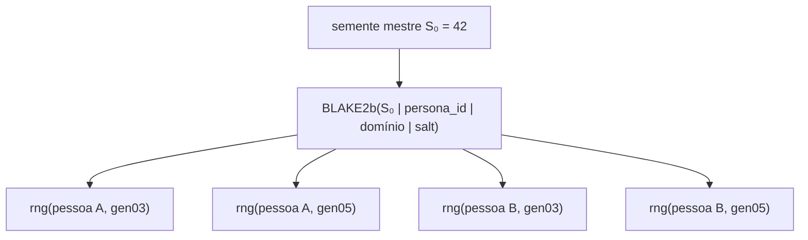

# Determinismo e reprodutibilidade

Reprodutibilidade é a propriedade central do PersonaDB: **mesma semente + mesma âncora temporal +
mesma versão do código = dataset idêntico**, byte a byte.

## As quatro fontes de não-determinismo (e como são eliminadas)

| Fonte | Solução adotada |
|---|---|
| Geradores pseudoaleatórios globais | `SeededRNG` encapsula um `numpy.random.Generator` (PCG64) próprio; o módulo `random` e o estado global do NumPy nunca são usados |
| Relógio do sistema | `simulation_today()` lê `PERSONADB_TODAY` ou cai no literal `date(2026, 1, 1)` |
| Identificadores aleatórios | Todos os UUIDs vêm de `uuid5(NAMESPACE_URL, chave_determinística)` — nunca `uuid4()` |
| Ordem de iteração | Listas ordenadas e `sorted()` em pontos de agregação; dicionários do Python preservam ordem de inserção |

## Forking hierárquico de sementes

Em vez de consumir um único fluxo sequencial (que acopla o resultado de uma pessoa à ordem das
chamadas de todas as outras), cada combinação *persona × domínio* recebe um sub-gerador próprio:

$$S(p, d, \text{salt}) = \text{int64}_{\text{big}}\Big(\text{BLAKE2b}\big(\text{UTF8}(S_0 \,\|\, p \,\|\, d \,\|\, \text{salt})\big)_{0..7}\Big)$$

```python
from persona_db.engines.rng import new_rng

master = new_rng(42)
rng_saude  = master.fork(persona["id"], "gen03")
rng_impact = master.fork(persona["id"], "gen03-impact")
```



Propriedades que isso garante:

1. **Isolamento.** Alterar o gerador de saúde não muda nada no gerador de carreira da mesma pessoa.
2. **Independência de ordem.** Gerar as personas em qualquer ordem produz o mesmo resultado por
   persona, porque a semente depende do `persona_id`, não da posição no laço.
3. **Descorrelação.** Duas personas com IDs diferentes produzem fluxos sem correlação observável,
   porque o hash criptográfico difunde qualquer semelhança nas entradas.
4. **Rastreabilidade.** `(S₀, persona_id, domínio, salt)` reconstrói exatamente o fluxo usado, o que
   permite depurar um único registro sem regerar o dataset inteiro.

## Regras para quem escreve código

:::danger Proibido em qualquer módulo de `persona_db`
```python
import random                 # ❌ estado global
random.choice(...)            # ❌
np.random.rand()              # ❌ estado global do NumPy
uuid.uuid4()                  # ❌ não reprodutível
datetime.date.today()         # ❌ depende do relógio
```
:::

:::tip Faça assim
```python
from uuid import NAMESPACE_URL, uuid5
from persona_db.engines.rng import new_rng
from persona_db.generators.gen_00_pessoa import simulation_today

master = new_rng(seed)
today = today or simulation_today()
rng = master.fork(persona["id"], "gen42-meu-dominio")

row_id = str(uuid5(NAMESPACE_URL, f"minha-tabela-{persona['id']}-{indice}"))
valor = rng.normal_clipped(mu=1.0, sigma=0.2, low=0.0, high=2.0)
```
:::

## Amostradores disponíveis em `SeededRNG`

| Método | Uso típico |
|---|---|
| `bernoulli(p)` | eventos binários (casou? adoeceu?) |
| `choice(options, weights=None)` | escolha categórica ponderada |
| `integer(low, high)` | inteiro inclusivo (meses de pena, dose de vacina) |
| `uniform(low, high)` | multiplicadores contínuos |
| `normal(mu, sigma)` / `normal_clipped(mu, sigma, low, high)` | estaturas, resíduos, notas |
| `log_normal(mu, sigma)` | valores monetários com cauda longa |
| `poisson(lam)` | contagens (filhos, consultas) |
| `beta_sample(alpha, beta)` | proporções em `[0, 1]` |
| `dirichlet(alphas)` | composições que somam 1 (ancestralidade) |

A referência completa está em [`engines/rng.py`](../referencia-api/engines/rng.md).

## Testando o determinismo

A suíte cobre isso explicitamente em `persona_db/tests/unit/test_rng.py` e
`persona_db/tests/integration/test_full_generation.py`:

```python
def test_mesma_semente_mesmo_resultado():
    a = generate_all(n=20, seed=7)
    b = generate_all(n=20, seed=7)
    assert {k: len(v) for k, v in a.items()} == {k: len(v) for k, v in b.items()}
```

Na linha de comando:

```bash
python3 -m persona_db.scripts.generate --personas 50 --seed 7 --output a.json
python3 -m persona_db.scripts.generate --personas 50 --seed 7 --output b.json
cmp a.json b.json && echo "determinístico"
```

## Limites do determinismo

- **Versões de biblioteca.** O PCG64 do NumPy é estável entre versões, mas mudanças em `numpy` que
  afetem `Generator.choice` ou `dirichlet` podem alterar resultados. Fixe as versões se precisar de
  reprodutibilidade de longo prazo.
- **Mudanças de código.** Qualquer alteração na ordem das chamadas ao RNG dentro de um gerador muda
  o resultado daquele domínio (por isso o forking por domínio importa: o impacto fica contido).
- **Tamanho do lote.** Personas são construídas individualmente, mas alguns domínios (genealogia,
  rede social) formam pares entre personas — logo, mudar `--personas` muda o grafo de relações.
