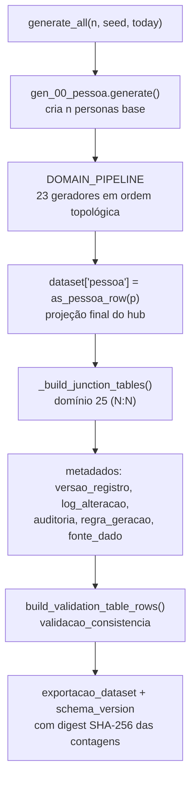
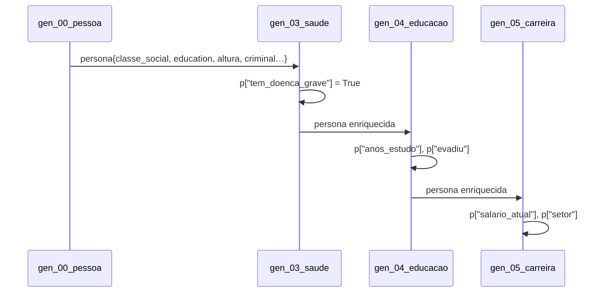

# Pipeline de geração

Todo o fluxo vive em [`persona_db/scripts/generate.py`](../referencia-api/scripts/generate.md),
cuja função `generate_all(n, seed, today, domains)` é o ponto de entrada programático
(`generate_dataset` é um alias).

## Etapas



## Ordem topológica

A tupla `DOMAIN_PIPELINE` fixa a ordem — ela não é alfabética, e sim ditada pelas dependências de
dados entre domínios:

| # | Gerador | Depende de | Porque |
|---|---|---|---|
| 1 | `gen_02_genealogia` | personas base | cria pais/mães e vincula `pai_id`/`mae_id` antes de qualquer herança |
| 2 | `gen_01_identidade` | genealogia | fenótipos e sobrenomes dependem dos progenitores |
| 3 | `gen_03_saude` | identidade | predisposição genética e idade definem diagnósticos |
| 4 | `gen_18_religiao` | saúde | religiosidade entra como fator protetivo adiante |
| 5 | `gen_04_educacao` | saúde | doença grave afeta evasão escolar |
| 6 | `gen_20_militar` | educação | alistamento depende de idade/escolaridade |
| 7 | `gen_05_carreira` | educação, militar | escolaridade e experiência definem salário |
| 8 | `gen_06_financas` | carreira | renda define patrimônio, dívidas e investimentos |
| 9 | `gen_07_residencia` | finanças | capacidade de compra/aluguel define a moradia |
| 10 | `gen_11_juridico` | carreira, residência | processos e penas afetam emprego e endereço |
| 11 | `gen_08_relacionamentos` | jurídico | antecedentes criminais entram no risco de divórcio |
| 12 | `gen_09_rede_social` | relacionamentos | amizades e grupos reaproveitam o núcleo familiar |
| 13 | `gen_12_eleitoral` | rede social | filiação e voto usam idade e perfil social |
| 14 | `gen_13_viagens` | eleitoral | companhias de viagem reaproveitam vínculos |
| 15 | `gen_21_imigracao` | viagens | vistos e travessias dependem das viagens |
| 16 | `gen_10_digital` | imigração | contas e dispositivos conforme classe e idade |
| 17 | `gen_14_pets` | digital | — |
| 18 | `gen_15_consumo` | pets | compras incluem itens para pets |
| 19 | `gen_17_comportamento` | consumo | preferências refletem hábitos de consumo |
| 20 | `gen_19_esporte` | comportamento | hobbies derivam de traços de personalidade |
| 21 | `gen_22_comunicacao` | esporte | contatos e mensagens entre vínculos já criados |
| 22 | `gen_23_midia` | comunicação | reputação consolida eventos anteriores |
| 23 | `gen_16_timeline` | **todos** | a linha do tempo consolida eventos de todos os domínios |

O catálogo completo, com as tabelas que cada gerador popula, está em
[Catálogo dos geradores](../geradores/catalogo.md) — gerado a partir do código.

:::info Geradores com acesso ao dataset parcial
Quatro domínios recebem o argumento extra `existing_tables` com tudo o que já foi gerado:
`07_residencia`, `11_juridico`, `13_viagens` e `16_timeline`. É assim que a linha do tempo consegue
referenciar eventos criados por outros domínios.
:::

## Enriquecimento progressivo da persona

O dicionário da persona é **mutável e compartilhado**: cada gerador pode acrescentar campos
derivados que os seguintes consomem.



Os campos do contrato base estão listados em [Contratos de dados](./contratos-de-dados.md).

## Pós-processamento

Depois dos geradores, `generate_all` executa três blocos:

1. **Projeção do hub** — `gen_00_pessoa.as_pessoa_row(p)` reduz o dict rico da persona às colunas
   reais da tabela `pessoa`. Isso acontece **no fim**, para capturar enriquecimentos (como
   `pai_id`, `tipo_sanguineo` e `estado_civil` atualizados).
2. **Junções N:N (domínio 25)** — `_build_junction_tables()` deriva 14 tabelas de ligação a partir
   das tabelas já geradas, deduplicando pares. Veja [Junções e metadados](../geradores/juncoes-e-metadados.md).
3. **Metadados (domínios 24 e 26)** — `versao_registro`, `log_alteracao`, `auditoria`,
   `regra_geracao` (uma linha por posição do pipeline), `fonte_dado` (uma por tabela),
   `validacao_consistencia`, `exportacao_dataset` (com digest SHA-256 das contagens) e
   `schema_version`.

## Executando parcialmente

```bash
# só genealogia e saúde (útil ao desenvolver um domínio)
python3 -m persona_db.scripts.generate --personas 100 --domains 02_genealogia,03_saude --dry-run
```

O filtro `--domains` compara com o **nome do domínio** (`02_genealogia`), não com o nome do módulo.
Incluir `25_juncoes` no conjunto força a derivação das tabelas de junção; os metadados são sempre
gerados.

:::caution Dependências não são resolvidas automaticamente
O filtro não puxa dependências: rodar apenas `05_carreira` sem `04_educacao` produz um dataset
pobre (e possivelmente reprovado na validação), porque os campos derivados esperados não existem.
:::

## Uso programático

```python
from persona_db.scripts.generate import generate_all
from persona_db.validators.run_validators import validate_dataset

dataset = generate_all(n=250, seed=42)
report = validate_dataset(dataset)

print(report["passed"], report["overall_consistency_pct"])
print(len(dataset["pessoa"]), "personas em", len(dataset), "tabelas")
```
