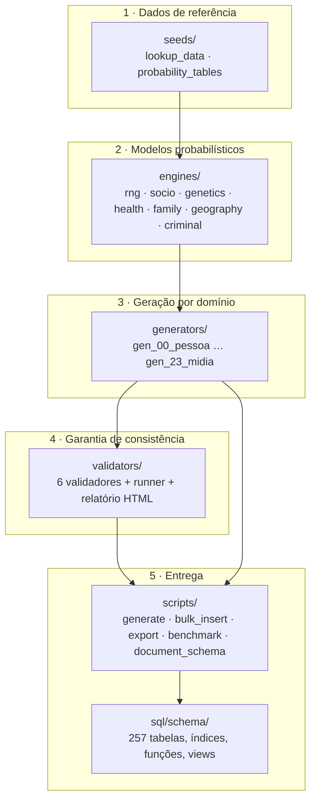

# Visão geral da arquitetura

O PersonaDB é organizado em cinco camadas, com dependência estritamente unidirecional: cada camada
só conhece as camadas abaixo dela.

## As camadas

### 1. `seeds/` — dados de referência determinísticos

Catálogos fechados e tabelas de probabilidade: nomes próprios e sobrenomes, 60 cidades fictícias,
bairros, bancos, empresas (com CNPJ fictício que passa no dígito verificador), universidades,
hospitais, profissões, doenças, medicamentos, cursos, raças de pets, partidos, histórico de salário
mínimo e série de IPCA; além das matrizes de mobilidade social, tábua de mortalidade, incidência de
doenças, taxas de criminalidade, taxas de emprego, curva de Lorenz e mapeamento
ancestralidade → traços fenotípicos. Veja [Dados de referência](../seeds/index.md).

### 2. `engines/` — modelos matemáticos

Sete motores encapsulam toda a estatística do projeto. Eles não sabem nada sobre tabelas SQL:
recebem parâmetros e devolvem valores. É aqui que estão a cadeia de Markov de classe social, a
equação de Mincer, os quadrados de Punnett, a mortalidade de Gompertz–Makeham, a fecundidade de
Poisson, o modelo gravitacional de migração e o modelo logístico de risco criminal.
Veja [Motores matemáticos](../motores/index.md).

### 3. `generators/` — tradução para o schema

Vinte e quatro módulos, um por domínio do schema. Cada um recebe a lista de personas e devolve um
dicionário `{"tabela": [linhas]}`. Os geradores:

- **enriquecem** o dict da persona com campos derivados (ex.: `gen_03_saude` escreve
  `tem_doenca_grave`), que domínios seguintes consomem;
- usam **exclusivamente** `master.fork(persona["id"], "dominio")` como fonte de aleatoriedade;
- respeitam a ordem topológica declarada em `DOMAIN_PIPELINE`.

Veja [Geradores de domínio](../geradores/index.md) e o [contrato](../geradores/contrato.md).

### 4. `validators/` — invariantes

Seis validadores (genealogia, temporal, finanças, saúde, jurídico-eleitoral e social) mais quatro
verificações estruturais básicas percorrem o dataset em memória e devolvem uma lista de violações.
O runner consolida tudo em um relatório com percentual de consistência por domínio, gera as linhas
da tabela `validacao_consistencia` e, opcionalmente, um relatório HTML.
Veja [Validadores](../validadores/index.md).

### 5. `scripts/` e `sql/` — entrega

Os CLIs orquestram geração, carga em lote, exportação, benchmark e documentação do schema. Os
arquivos DDL definem as 257 tabelas, as partições, os índices, as funções, os gatilhos e as views.
Veja [Linha de comando](../cli/generate.md) e [Schema SQL](../schema/index.md).

## Princípios de projeto

| Princípio | Como é aplicado |
|---|---|
| **Determinismo antes de tudo** | Nenhum `random`, `uuid4()` ou `date.today()`; UUIDs vêm de `uuid5` e aleatoriedade de `SeededRNG` |
| **Memória antes do banco** | O pipeline inteiro roda em dicionários Python; o PostgreSQL é um destino, não um requisito |
| **Validação como parte da geração** | `generate` roda os validadores por padrão e falha com `exit 1` |
| **Dependências explícitas** | A ordem dos geradores é uma tupla declarada, não um efeito colateral de imports |
| **Dados fictícios por construção** | Catálogos inventados (`Hipertensão Simulada`, `Banco Fictício`), nunca listas reais |
| **Documentação derivada do código** | `document_schema.py` gera `SCHEMA.md`; este site gera a referência de API e o catálogo do schema |

## Onde cada coisa mora

| Preciso de… | Vá para |
|---|---|
| Entender a reprodutibilidade | [Determinismo](./determinismo.md) |
| Saber a ordem de execução | [Pipeline de geração](./pipeline.md) |
| Saber o formato dos dicionários trocados entre módulos | [Contratos de dados](./contratos-de-dados.md) |
| Encontrar um arquivo | [Estrutura de diretórios](./estrutura-de-diretorios.md) |
