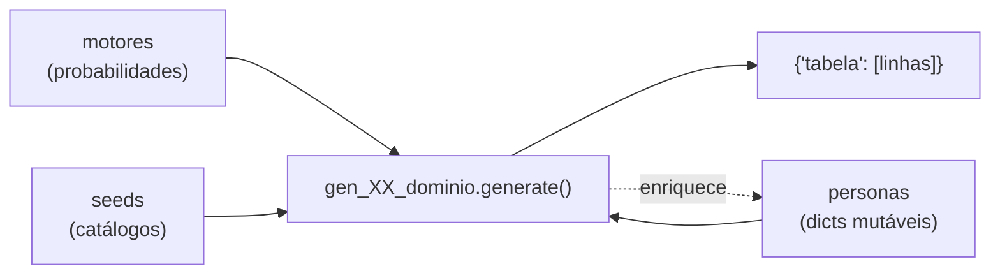

# Geradores de domínio

Cada um dos 24 módulos em [`persona_db/generators/`](/docs/referencia-api/generators) é responsável
por um domínio do schema. Eles são a cola entre os [motores matemáticos](../motores/index.md) e as
[257 tabelas](../schema/index.md).



## Responsabilidades de um gerador

1. **Consumir** a lista de personas e os campos já derivados por domínios anteriores.
2. **Sortear** eventos usando apenas `master.fork(persona["id"], "domínio")`.
3. **Produzir** linhas com as colunas exatas do DDL correspondente.
4. **Enriquecer** a persona com campos que domínios posteriores precisarão.
5. **Respeitar a cronologia**: nada antes do nascimento, nada depois do óbito ou da âncora temporal.

## Páginas desta seção

| Página | Conteúdo |
|---|---|
| [Contrato](./contrato.md) | assinatura, convenções, checklist e exemplo mínimo |
| [Catálogo](./catalogo.md) | **gerado do código**: os 24 geradores, ordem no pipeline e tabelas populadas |
| [Junções e metadados](./juncoes-e-metadados.md) | domínios 24, 25 e 26 derivados pelo orquestrador |

## Agrupamento por "estágio de vida"

Embora a execução siga a [ordem topológica do pipeline](../arquitetura/pipeline.md), é útil pensar
nos geradores por tema:

| Tema | Geradores |
|---|---|
| Núcleo e identidade | `gen_00_pessoa`, `gen_01_identidade`, `gen_02_genealogia` |
| Corpo e mente | `gen_03_saude`, `gen_17_comportamento` |
| Formação e trabalho | `gen_04_educacao`, `gen_20_militar`, `gen_05_carreira` |
| Patrimônio e moradia | `gen_06_financas`, `gen_07_residencia` |
| Instituições e Estado | `gen_11_juridico`, `gen_12_eleitoral`, `gen_21_imigracao` |
| Vínculos | `gen_08_relacionamentos`, `gen_09_rede_social`, `gen_22_comunicacao` |
| Vida cotidiana | `gen_10_digital`, `gen_13_viagens`, `gen_14_pets`, `gen_15_consumo`, `gen_18_religiao`, `gen_19_esporte` |
| Consolidação | `gen_23_midia`, `gen_16_timeline` |

## Catálogos internos

Vários geradores constroem **catálogos determinísticos** antes do laço de personas — hospitais,
tribunais, empresas, lojas, destinos. Eles recebem IDs `uuid5` estáveis e são compartilhados por
todas as personas, imitando entidades do mundo real que existem independentemente dos indivíduos.

```python
def _build_catalogs(rows: dict[str, list[dict]]) -> None:
    for nome, categoria, gravidade in _DOENCAS:
        rows["doenca"].append({
            "id": str(uuid5(NAMESPACE_URL, f"doenca-{nome}")),
            "nome": nome, "categoria": categoria, "gravidade_padrao": gravidade,
        })
```

Como o ID deriva do nome, o mesmo hospital tem o mesmo UUID em qualquer execução — inclusive entre
datasets diferentes.

## Para criar um domínio novo

Siga o passo a passo em [Adicionar um novo domínio](../guias/novo-dominio.md).
