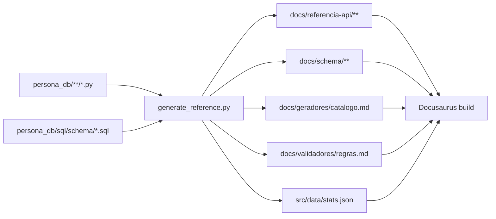

# Documentação e site

Este site é um [Docusaurus 3](https://docusaurus.io/) em `website/`, com parte do conteúdo escrito à
mão e parte **gerada a partir do código-fonte**.

## Rodar localmente

```bash
cd website
npm install
npm start          # http://localhost:3000/PersonaDB/
```

| Script | O que faz |
|---|---|
| `npm run gen:docs` | Executa `scripts/generate_reference.py` (apenas stdlib do Python) |
| `npm start` | Regenera a documentação automática e sobe o servidor de desenvolvimento |
| `npm run build` | Regenera e constrói o site estático em `website/build/` |
| `npm run serve` | Serve o build local |
| `npm run typecheck` | Checa os tipos TypeScript da configuração |
| `npm run clear` | Limpa o cache do Docusaurus |

Os hooks `prestart` e `prebuild` chamam `gen:docs`, então as páginas automáticas nunca ficam
desatualizadas em um build limpo.

## O que é gerado

| Destino | Origem | Versionado? |
|---|---|---|
| `docs/referencia-api/**` | análise `ast` de todos os módulos de `persona_db/` | não |
| `docs/schema/**` | parsing dos DDL em `persona_db/sql/schema/*.sql` | não |
| `docs/geradores/catalogo.md` | docstrings + tabelas detectadas nos geradores | não |
| `docs/validadores/regras.md` | literais `"rule": "…"` nos validadores | não |
| `src/data/stats.json` | contagens usadas na página inicial | sim |

Tudo o mais em `docs/` é escrito à mão.



## Como o gerador funciona

`website/scripts/generate_reference.py` usa **somente a biblioteca padrão** — não importa
`persona_db`, portanto não precisa de `numpy`, `scipy` nem de qualquer dependência instalada. Isso
mantém o build do site rápido e independente do ambiente Python do projeto.

Para cada módulo ele extrai docstring, constantes, classes (com atributos e métodos públicos),
funções com assinatura completa e número da linha, gerando links diretos para o GitHub. Para cada
arquivo DDL, extrai tabelas, colunas, tipos, nulidade, defaults, `CHECK`, chaves estrangeiras,
ENUMs, funções, views, triggers e índices, além de montar o diagrama ER em Mermaid.

A ligação **tabela → gerador responsável** é inferida cruzando os nomes de tabela do DDL com as
chaves de dicionário efetivamente **escritas** por cada gerador: `rows = {"tabela": []}`, o
dicionário do `return`, `rows["tabela"].append(...)`/`.extend(...)`, `rows["tabela"] = [...]` e
`rows.setdefault("tabela", [])`. Leituras (`row["nota"]`) e escritas em tabelas recebidas por
parâmetro (`existing_tables["contrato_trabalho"]`) são ignoradas, para não atribuir ao módulo
tabelas que ele apenas consome.

## Escrevendo páginas à mão

- Arquivos `.md` são interpretados como **CommonMark** (`markdown.format: 'detect'`); use `.mdx`
  apenas se precisar de JSX.
- Front matter recomendado: `title`, `sidebar_label`, `sidebar_position`, `description`.
- Matemática com KaTeX: `$inline$` e `$$bloco$$`.
- Diagramas com blocos ```` ```mermaid ````.
- Admonições: `:::tip`, `:::note`, `:::info`, `:::caution`, `:::danger`.
- Links entre páginas devem usar caminhos relativos com extensão (`../motores/rng.md`), para que o
  Docusaurus valide links quebrados no build.

Páginas novas escritas à mão precisam ser adicionadas a `website/sidebars.ts` (a sidebar principal
é explícita; as de API e schema são autogeradas a partir dos diretórios).

## Publicação

O workflow `.github/workflows/docs.yml` monta e publica o site no GitHub Pages a cada push na
branch `main` (e sob demanda, com `workflow_dispatch`). Em pull requests ele roda o build sem
publicar, servindo de gate contra links quebrados.

Como o Pages aceita um único artefato por repositório, o workflow junta as duas fontes:

| Caminho publicado | Origem |
|---|---|
| `https://havaianasdestruido.github.io/PersonaDB/` | raiz do repositório, construída com Jekyll |
| `https://havaianasdestruido.github.io/PersonaDB/docs/` | este site, construído com Docusaurus |

Por isso `docusaurus.config.ts` usa `url: https://havaianasdestruido.github.io` com
`baseUrl: '/PersonaDB/docs/'` e `routeBasePath: '/'` no plugin de docs — as páginas ficam
diretamente sob `/docs/` (por exemplo `/PersonaDB/docs/motores/rng`).

:::note Workflow Jekyll legado
`jekyll-gh-pages.yml` continua no repositório, mas só roda por `workflow_dispatch`: o artefato dele
contém apenas a raiz e sobrescreveria `/docs`. A construção automática da raiz passou a ser feita
pelo próprio `docs.yml`.
:::

## Fontes auxiliares

| Arquivo do repositório | Papel na documentação |
|---|---|
| `README.MD` | resumo e quick start (espelhado em [Introdução](../intro.md)) |
| `PERSONA.MD` | especificação conceitual das entidades |
| `persona_db/docs/MATH_MODELS.md` | formulação matemática de referência dos motores |
| `persona_db/docs/SCHEMA.md` | dicionário de dados versionado, gerado por `document_schema.py` |
| `TODO.MD` | backlog por tarefa |
| `rewrite.MD` | estudo de performance (não implementado) |
