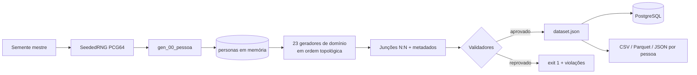

# PersonaDB

O **PersonaDB** é um motor determinístico de geração de dados sintéticos e relacionais para
**personas fictícias brasileiras**. Ele cobre 25 domínios da vida humana — de genealogia e saúde a
finanças, justiça, consumo e reputação na mídia — materializados em **257 tabelas PostgreSQL 16**.

Todos os registros são **100% fictícios** e **reproduzíveis**: a partir de uma única semente mestre
(`SeededRNG`, PCG64 com derivação criptográfica BLAKE2b), a mesma execução produz exatamente o mesmo
dataset, bit a bit.

```bash
python3 -m pip install -e "persona_db[dev,parquet]"
python3 -m persona_db.scripts.generate --personas 200 --seed 42 --output dataset.json
```

## Por que ele existe

| Caso de uso | Como o PersonaDB ajuda |
|---|---|
| Testes de integração e QA | Popular um PostgreSQL inteiro com dados coerentes sem tocar em dados reais |
| Demonstrações e ambientes de staging | Personas plausíveis, com histórias de vida consistentes entre domínios |
| Ensino de modelagem de dados e SQL | 257 tabelas reais, com FKs, partições, views, triggers e índices |
| Benchmarks de carga | Geração de milhares de personas e milhões de linhas de forma reprodutível |
| Pesquisa em dados sintéticos | Motores probabilísticos explícitos, calibrados e documentados |

:::danger Nada aqui é real
Nomes, CPFs, endereços, empresas, hospitais, processos judiciais e qualquer outro identificador são
inventados. O projeto **não** reproduz, anonimiza nem deriva dados de pessoas reais e não deve ser
usado para simular identidades verificáveis. Veja [Ética e limitações](./projeto/etica-e-limitacoes.md).
:::

## O que torna o projeto diferente

- **Determinismo total.** Nenhum módulo usa `random` global ou relógio do sistema: o tempo é
  ancorado em `PERSONADB_TODAY` e toda aleatoriedade vem de `SeededRNG.fork(persona_id, domínio)`.
  Veja [Determinismo e reprodutibilidade](./arquitetura/determinismo.md).
- **Coerência entre domínios.** O tipo sanguíneo respeita o quadrado de Punnett dos pais; o salário
  respeita o piso vigente no ano da contratação; antecedentes criminais bloqueiam setores de
  emprego; óbito encerra todos os registros posteriores.
- **Modelos explícitos.** Mobilidade social (Markov), escolaridade (logit), salários (Mincer),
  mortalidade (Gompertz–Makeham), fecundidade (Poisson), migração (gravidade) — todos descritos em
  [Motores matemáticos](./motores/index.md).
- **Validação embutida.** Seis validadores percorrem o dataset gerado e reprovam a execução quando
  qualquer invariante é quebrada. Veja [Validadores](./validadores/index.md).

## Fluxo em uma imagem



## Como navegar nesta documentação

| Seção | Para quem |
|---|---|
| [Começando](./comecando/instalacao.md) | Quem quer instalar e gerar o primeiro dataset |
| [Arquitetura](./arquitetura/visao-geral.md) | Quem precisa entender pipeline, determinismo e contratos |
| [Motores matemáticos](./motores/index.md) | Quem quer entender ou recalibrar os modelos probabilísticos |
| [Geradores](./geradores/index.md) | Quem vai escrever ou alterar um domínio |
| [Validadores](./validadores/index.md) | Quem precisa garantir consistência dos dados |
| [Linha de comando](./cli/generate.md) | Quem opera a geração, carga e exportação |
| [Referência de API](./referencia-api/index.md) | Consulta módulo a módulo, gerada do código-fonte |
| [Schema SQL](./schema/index.md) | Consulta tabela a tabela, gerada dos arquivos DDL |

:::tip Documentação sempre em sincronia
As seções **Referência de API**, **Schema SQL**, o [catálogo de geradores](./geradores/catalogo.md)
e o [catálogo de regras](./validadores/regras.md) são **gerados a partir do código** a cada build
(`npm run gen:docs`). Se o código mudar, a documentação muda junto. Detalhes em
[Documentação e site](./guias/documentacao.md).
:::
