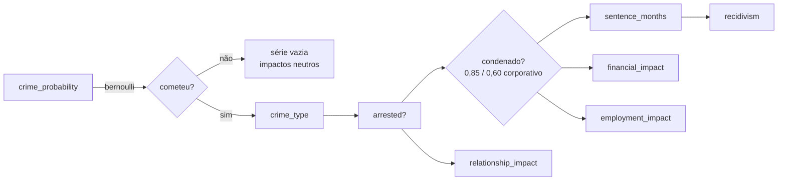

# `CriminalEngine` — envolvimento criminal e consequências

Arquivo: [`persona_db/engines/criminal.py`](../referencia-api/engines/criminal.md)

:::danger Modelo sintético, não preditivo
Os coeficientes abaixo foram escolhidos para **produzir dados internamente coerentes**, não para
estimar risco criminal de pessoas reais. Usar este motor (ou dados dele derivados) para avaliar
indivíduos é um uso indevido do projeto. Veja [Ética e limitações](../projeto/etica-e-limitacoes.md).
:::

## 1. Probabilidade de envolvimento (logística)

Os coeficientes ficam em `engines/constants.py::RISK_LOGLIT`:

$$\text{logit}(p) = -3{,}50 + \sum_j \beta_j x_j$$

| Fator | $\beta$ |
|---|---|
| sexo masculino | +1,80 |
| idade entre 15 e 25 | +0,90 |
| classe D/E | +0,70 |
| pai com histórico criminal | +1,10 |
| mãe com histórico criminal | +0,80 |
| irmão com histórico criminal | +0,60 |
| desemprego | +0,50 |
| abandono escolar | +0,40 |
| transtorno mental | +0,30 |
| ensino superior | −0,90 |
| renda alta | −0,80 |
| intercepto | −3,50 |

```python
engine.crime_probability({"sex": "masculino", "age": 22, "class_label": "D_E",
                          "education": "medio", "unemployed": True})
engine.commits_crime(features)   # Bernoulli sobre a probabilidade acima
```

## 2. Tipo de crime, prisão e pena

| Tipo | Pena (meses) | P(prisão) |
|---|---|---|
| `crimes_violentos` | 36 – 144 | 0,65 |
| `crimes_patrimoniais` | 12 – 60 | 0,38 |
| `crimes_digitais` | 24 – 72 | 0,22 |
| `crimes_de_transito` | 6 – 36 | 0,55 |
| `crimes_corporativos` | 12 – 48 | 0,10 |
| `trafico` | 60 – 180 | 0,58 |

`arrested(crime_type, class_label, quality_advocate=0.5)` modula a probabilidade de prisão pela
classe social e pela qualidade da defesa — o viés de classe é explícito e intencional no modelo.
Para reincidentes, `sentence_months` **dobra o piso** da faixa.

## 3. Reincidência

$$p_{\text{reinc}} = 0{,}42 - 0{,}30\,\mathbb{I}(\text{emprego formal}) - 0{,}20\,\mathbb{I}(\text{suporte familiar}) + \varepsilon,
\qquad \varepsilon \sim \mathcal{N}(0; 0{,}05^2)$$

limitada a $[0{,}05;\ 0{,}75]$.

## 4. Impactos em outros domínios

```python
engine.employment_impact(has_antecedent=True, sector="publico")
# {"hiring_multiplier": 0.45, "salary_reduction": ~0.325,
#  "barred_sectors": ["publico", "financeiro", "educacao"], "blocked": True}

engine.relationship_impact(arrested=True, domestic_violence=False)
# {"divorce_prob": 0.73, "custody_loss": 0.10}

engine.financial_impact(went_to_court=True)
# {"cost_process": exp(N(9.5, 0.8²)), "asset_loss_prob": 0.28}
```

| Impacto | Efeito |
|---|---|
| Emprego | multiplicador de contratação 0,45; redução salarial ~32,5%; bloqueio nos setores público, financeiro e educação |
| Relacionamento | probabilidade de divórcio sobe de 0,15 para 0,73 após prisão; perda de guarda 0,65 em violência doméstica |
| Finanças | custo de processo log-normal; 28% de chance de perda patrimonial quando há ação judicial |

## 5. Trajetória completa

`criminal_process_series(features)` encadeia tudo e devolve o dicionário anexado à persona no campo
`criminal`:



```python
{"did_crime": True, "crime_type": "crimes_patrimoniais", "was_arrested": False,
 "convicted": False, "months_sentence": 0, "process_cost": 0.0,
 "divorce_impact": {...}, "employment_impact": {...}, "recidivism": False}
```

## Onde isso aparece no schema

`processo`, `pessoa_processo`, `julgamento`, `sentenca`, `pena`, `antecedente_criminal`,
`ocorrencia_policial`, `boletim_ocorrencia`, `multa`, `advogado`, `tribunal`; e indiretamente em
`contrato_trabalho` (setores bloqueados), `divorcio` e `patrimonio_snapshot`.
