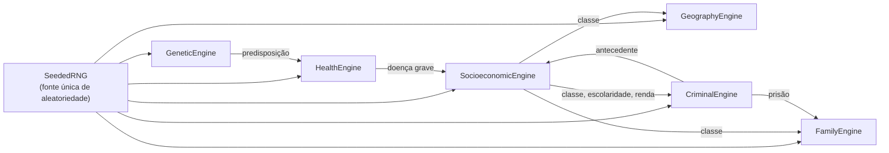

# Motores matemáticos

Os motores concentram toda a estatística do PersonaDB. Eles vivem em
[`persona_db/engines/`](/docs/referencia-api/engines), não conhecem tabelas SQL e são testados
isoladamente — o que permite recalibrar um modelo sem tocar em nenhum gerador.

| Motor | Classe | Modelos principais |
|---|---|---|
| [`rng.py`](./rng.md) | `SeededRNG` | PCG64 com forking BLAKE2b; normal truncada, log-normal, Poisson, Beta, Dirichlet |
| [`socio.py`](./socio.md) | `SocioeconomicEngine` | Cadeia de Markov 6×6 de mobilidade, logit de escolaridade, equação de Mincer, nepotismo |
| [`genetics.py`](./genetics.md) | `GeneticEngine` | Punnett ABO/Rh, herança poligênica de olhos e cabelos, mid-parent de Galton, lateralidade logística |
| [`health.py`](./health.md) | `HealthEngine` | Gompertz–Makeham, hazard por doença, risco mental, impacto crônico |
| [`family.py`](./family.md) | `FamilyEngine` | Hazard de nupcialidade, homogamia, fecundidade de Poisson, divórcio logístico |
| [`geography.py`](./geography.md) | `GeographyEngine` | 50+ cidades fictícias, segregação por bairro, modelo gravitacional, migração |
| [`criminal.py`](./criminal.md) | `CriminalEngine` | Risco logístico de crime, prisão por tipo, dosimetria, reincidência, impactos |

## Como os motores se relacionam



As setas de retorno (`HealthEngine → SocioeconomicEngine`, `CriminalEngine → SocioeconomicEngine`)
não são chamadas circulares: elas acontecem no nível dos **geradores**, que repassam resultados de
um motor como *features* de outro.

## Calibração compartilhada

Parâmetros usados por mais de um motor ficam em
[`engines/constants.py`](../referencia-api/engines/constants.md):

```python
SOCIAL_CLASS_DIST = {"A": 0.03, "B1": 0.07, "B2": 0.15, "C1": 0.22, "C2": 0.25, "D_E": 0.28}
BLOOD_GROUP_PRIORS = {"O": 0.47, "A": 0.41, "B": 0.09, "AB": 0.03}
DISEASE_TRANCHES = {"diabetes": {"min_age": 40, "hazard": 0.007}, …}
RISK_LOGLIT = {"intercept": -3.5, "masculino": 1.8, "idade_15_25": 0.9, …}
```

:::info Fonte dos números
As calibrações são *proxies* plausíveis para o Brasil (ordens de grandeza de ABEP/IBGE e literatura
demográfica), **não** estimativas oficiais. O objetivo é gerar dados internamente coerentes, não
reproduzir estatísticas reais com precisão. O documento
[`persona_db/docs/MATH_MODELS.md`](https://github.com/havaianasdestruido/PersonaDB/blob/main/persona_db/docs/MATH_MODELS.md)
traz a formulação original de referência.
:::

## Testes dos motores

| Arquivo | Cobertura |
|---|---|
| `tests/unit/test_rng.py` | determinismo, forking, faixas dos amostradores |
| `tests/unit/test_socio.py` | linhas da matriz somam 1, prêmio educacional, piso salarial |
| `tests/unit/test_genetics.py` | quadrados de Punnett, pais Rh− ⇒ filhos Rh−, olhos azuis recessivos |
| `tests/unit/test_health_criminal_family.py` | monotonicidade do hazard, efeito dos fatores de risco |
| `tests/unit/test_genetics_family_geo.py` | mid-parent, homogamia, pesos geográficos |
| `tests/unit/test_criminal.py` | sinal dos coeficientes logísticos, dosimetria, reincidência |
| `tests/statistical/test_distributions.py` | distribuições agregadas com N grande |
