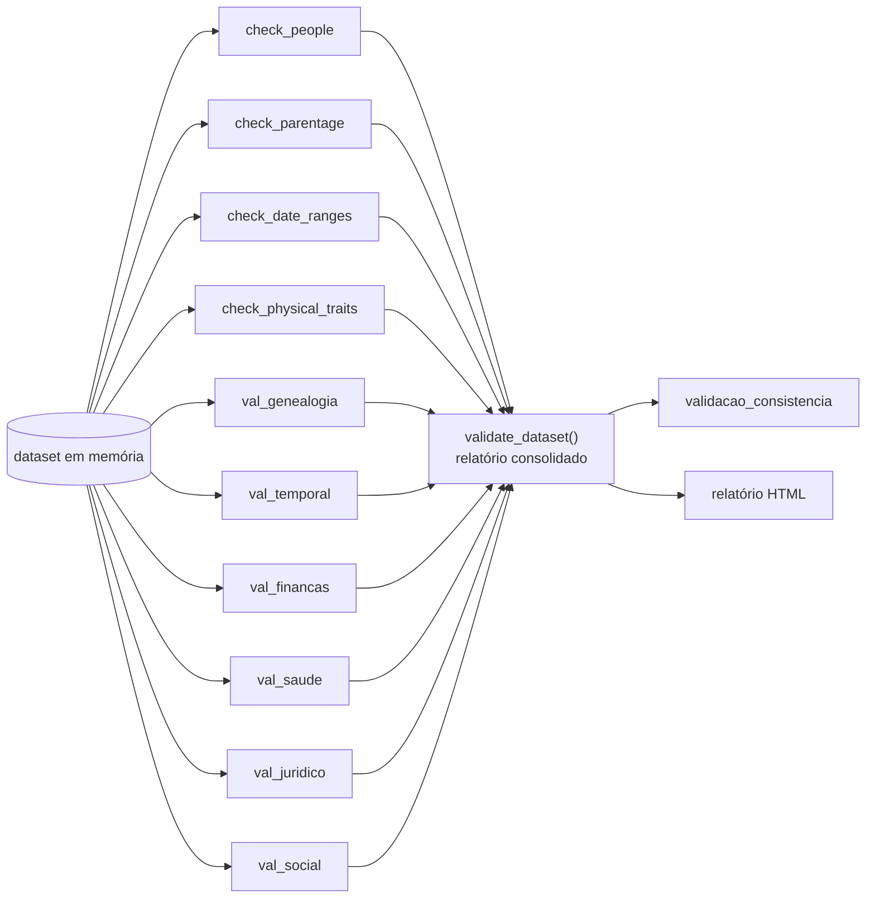

# Validadores de consistência

Gerar dados plausíveis é fácil; gerar dados **coerentes entre 257 tabelas** não é. A camada
[`persona_db/validators/`](/referencia-api/validators) percorre o dataset em memória e reprova a
execução quando qualquer invariante é quebrada.



## Verificações estruturais

Definidas no próprio `run_validators.py` e aplicadas antes dos validadores de domínio:

| Função | Verifica |
|---|---|
| `check_people` | `id` único; nascimento não futuro; óbito posterior ao nascimento; coerência entre `esta_vivo` e `data_obito` |
| `check_parentage` | progenitor com pelo menos 14 anos a mais que o filho; ausência de auto-parentesco |
| `check_date_ranges` | em **todas** as tabelas: `data_inicio <= data_fim` e `data_entrada <= data_saida` |
| `check_physical_traits` | altura entre 50 e 250 cm; peso entre 2 e 300 kg |

## Validadores de domínio

| Módulo | Regras principais |
|---|---|
| [`val_genealogia`](../referencia-api/validators/val_genealogia.md) | pais nunca mais jovens que filhos (≥ 14 anos); tipo sanguíneo ABO+Rh compatível por Punnett; cor dos olhos biologicamente possível |
| [`val_temporal`](../referencia-api/validators/val_temporal.md) | pares de datas coerentes (inclusive `data_ida`/`data_volta`); casamento a partir dos 16 anos; primeiro emprego a partir dos 14 (aprendiz/estágio) ou 18 (CLT/PJ/público) |
| [`val_financas`](../referencia-api/validators/val_financas.md) | saldo coerente com créditos e débitos; financiamento imobiliário dentro do valor do imóvel e juros em [0, 500]; salário ≥ mínimo vigente no ano (`MIN_WAGE_HISTORY`) |
| [`val_saude`](../referencia-api/validators/val_saude.md) | tipo sanguíneo igual em `pessoa` e `pessoa_caracteristica_fisica`; prescrições e cirurgias apenas com diagnóstico registrado |
| [`val_juridico`](../referencia-api/validators/val_juridico.md) | voto apenas acima de 16 anos na data da eleição; candidato filiado ao partido; sentença vinculada a julgamento; pena vinculada a sentença |
| [`val_social`](../referencia-api/validators/val_social.md) | nenhum casamento simultâneo ativo; filho com pai e mãe distintos e registro único; nenhuma auto-referência em relacionamentos, amizades e inimizades |

O [catálogo completo de regras](./regras.md) é extraído do código a cada build.

## Assinatura comum

```python
def validate_<dominio>(
    dataset: dict[str, list[dict]],
    today: date | None = None,
) -> list[dict]:
    """Devolve a lista de violações encontradas (vazia = aprovado)."""
```

Cada violação é um dicionário:

```python
{"domain": "genealogia", "rule": "parent_at_least_14",
 "person_id": "…", "parent_id": "…"}
```

## Executando

```bash
# valida um dataset regenerado com a mesma semente
python3 -m persona_db.validators.run_validators --personas 200 --seed 42 --html-out report.html
```

```python
from persona_db.scripts.generate import generate_all
from persona_db.validators import validate_dataset, validate_saude

dataset = generate_all(n=100, seed=7)

report = validate_dataset(dataset)          # relatório completo
violacoes = validate_saude(dataset)          # apenas um domínio
```

O comportamento detalhado do relatório (percentuais por domínio, HTML, código de saída) está em
[Relatório de validação](./relatorio.md).

## Testes

`persona_db/tests/unit/test_validators.py` constrói datasets propositalmente quebrados e confirma
que cada regra dispara — e que um dataset íntegro passa sem violações.
